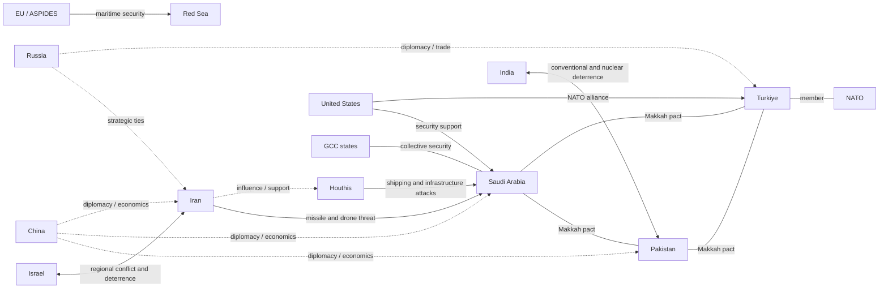
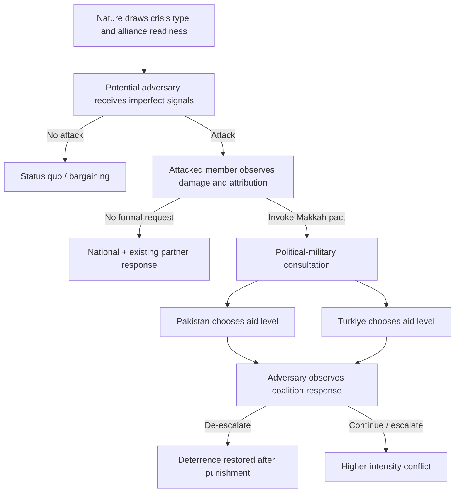
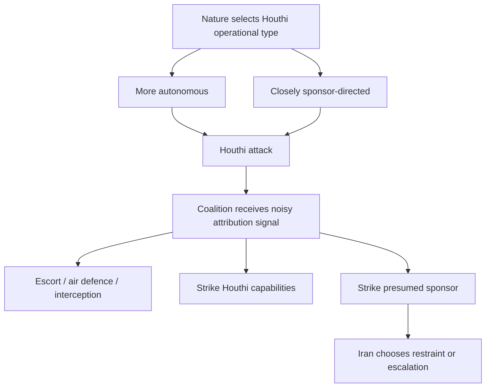

# Game-Theory Analysis of the Pakistan–Saudi Arabia–Türkiye Makkah Defence Pact

## Executive summary

The **Makkah Joint Defence Agreement**, signed by Saudi Arabia, Pakistan and Türkiye on **7 August 2026**, is best understood in game-theoretic terms not as a fully developed “Islamic NATO,” but as a **new probabilistic commitment device**. Its strategic purpose is to change what potential adversaries believe will happen after an attack. The official Saudi joint statement establishes the central collective-defence principle: an armed attack on one of the three is to be regarded as an attack on all. Turkish Foreign Minister Hakan Fidan subsequently clarified, however, that an attacked member must request assistance and specify what it needs; assistance can range from intelligence and logistics through ammunition to military units. A strategic political-military committee and a permanent Saudi-based secretariat are planned, while interoperability arrangements are still being developed. The publicly available document is a joint statement rather than a released full treaty text, so important legal and operational variables remain unknown. [Saudi Press Agency (SPA), 7 August 2026](https://www.spa.gov.sa/en/N2649227) citeturn18view0turn18view1

That distinction is crucial. **Deterrence does not require an adversary to believe that all three states will automatically go to war.** It requires the adversary to assign a sufficiently high probability to some costly response. In simplified terms, if an attacker believes there is probability \(q\) that the pact produces a robust military response, the agreement deters whenever the attacker's expected gains fall below the expected costs created by \(q\). The alliance therefore has military value even before it resembles NATO institutionally. Formal alliance theory supports precisely this logic: treaties can matter either by revealing intentions or by changing the political and material costs of refusing to help once a crisis occurs. [James Morrow, “Alliances: Why Write Them Down?”, Annual Review of Political Science](https://www.annualreviews.org/content/journals/10.1146/annurev.polisci.3.1.63) citeturn17search1turn17search4

The central finding of this report is that the pact's **most credible equilibrium is likely to be “automatic low-cost defensive assistance plus discretionary high-cost combat intervention.”** Intelligence sharing, missile warning, air defence, logistics, ammunition, maritime surveillance and defensive deployments can become credible because the costs to Pakistan and Türkiye are manageable relative to the reputational costs of abandoning Saudi Arabia. By contrast, participation in a major Saudi-Iranian war, an India-Pakistan war, or a Türkiye-Israel conflict can impose such large escalation and domestic costs that an unconditional promise to fight would often fail the test of *subgame perfection*: when the moment to execute the threat arrives, an ally may prefer not to carry it out. Fidan's own description of a graduated assistance mechanism strongly supports modeling the pact this way. citeturn18view1

Three crisis games produce different equilibrium predictions:

| Crisis | Model-predicted equilibrium | Alliance credibility |
|---|---|---|
| Sustained Iranian missile/drone attack on Saudi critical infrastructure | Saudi invocation followed by Pakistani/Turkish defensive military assistance; adversary de-escalation becomes increasingly attractive as visible deployments raise expected continuation costs | **Highest** |
| Houthi attacks on Red Sea shipping or Saudi-linked vessels | Maritime defence, intelligence, interception and possibly strikes on Houthi capabilities; direct escalation against Iran only if attribution becomes unusually strong | **Medium, highly attribution-dependent** |
| India–Pakistan escalation | Saudi/Turkish behavior conditioned heavily on perceived responsibility; diplomatic, financial, intelligence and defensive support considerably more likely than direct war with India | **Medium if Pakistan is clearly attacked; low if responsibility is ambiguous or Pakistan is seen as initiating escalation** |

The Iranian scenario is the pact's strongest game-theoretic case because Saudi Arabia has already faced large-scale missile and drone attacks in 2026. In an official letter to the UN Security Council, Riyadh stated that between 28 February and 2 April it had been targeted by **1,069 drones, 110 ballistic missiles and 20 cruise missiles**, including attempted attacks on civilian and energy facilities. These are Saudi government figures transmitted to the United Nations rather than an independently reconstructed strike count, but they establish what Saudi decision-makers publicly define as the threat environment. [Saudi letter to the UN Security Council, S/2026/283](https://digitallibrary.un.org/record/4108191/files/S_2026_283-EN.pdf) citeturn19search2

The Houthi scenario is harder. The central problem is **attribution**. A Houthi strike does not necessarily reveal how much operational control Iran exercised over that particular attack. The coalition therefore has to update its belief about Iranian responsibility from intelligence, communications intercepts, weapons forensics and attack patterns. In a Bayesian equilibrium, defensive maritime measures can be optimal at much lower confidence levels than direct retaliation against Iran. Existing third-party operations reinforce this equilibrium: the EU's EUNAVFOR ASPIDES mission is authorized through February 2027 to provide defensive maritime security and vessel protection in the Red Sea and surrounding waters. [Council of the European Union](https://www.consilium.europa.eu/en/press/press-releases/2026/02/23/red-sea-council-extends-the-mandate-of-operation-aspides-to-safeguard-freedom-of-navigation/) citeturn19search7

The India-Pakistan scenario presents the strongest **abandonment-versus-entrapment dilemma**, in Glenn Snyder's classic alliance terminology. Saudi Arabia and Türkiye want the pact to deter an attack on Pakistan, but neither benefits from encouraging Pakistani risk-taking on the assumption that its partners will subsequently rescue it. Their rational strategy is therefore likely to be *conditional commitment*: maintain enough ambiguity to make India account for possible external involvement, while privately making clear to Pakistan that support is greater when Pakistan is demonstrably the victim rather than the initiator. [Glenn Snyder, “The Security Dilemma in Alliance Politics”](https://www.cambridge.org/core/journals/world-politics/article/security-dilemma-in-alliance-politics/681B1AF11D96E61995028026205CE783) citeturn17search5

Pakistan's nuclear arsenal adds another incomplete-information variable but should not be conflated with a Saudi or Turkish nuclear guarantee. SIPRI estimates Pakistan at approximately **170 nuclear warheads as of January 2026**, compared with roughly 190 for India and 90 for Israel. No publicly verified arrangement demonstrates that Pakistan has placed Saudi Arabia or Türkiye beneath an extended nuclear-deterrence umbrella. The correct model therefore treats “nuclear extension” as an uncertain parameter \(n\), not an established treaty provision. [SIPRI, World Nuclear Forces, January 2026](https://www.sipri.org/visualizations/2026/world-nuclear-forces-january-2026) citeturn18view5

Türkiye's NATO membership likewise matters, but mainly by changing costs, capabilities and beliefs. NATO's Article 5 applies to NATO allies within the treaty's legal framework; Saudi Arabia and Pakistan do not acquire NATO protection merely through a separate treaty with Türkiye. NATO's own treaty also allows each ally to take such action as it “deems necessary,” rather than prescribing an automatic declaration of war. [North Atlantic Treaty, Articles 5–6](https://www.nato.int/en/about-us/official-texts-and-resources/official-texts/1949/04/04/the-north-atlantic-treaty) citeturn18view6

The pact's central strategic problem can therefore be stated succinctly:

\[
\boxed{\text{How can the three states make intervention credible enough to deter attack without making it so automatic that they invite entrapment?}}
\]

The answer suggested by the models below is **graduated commitment**. The alliance becomes substantially more credible if it precommits to an automatic minimum defensive package while leaving offensive war discretionary. Joint early warning, integrated air and missile defence, a permanent crisis cell, pre-designated reinforcement units, pre-positioned ammunition, logistics agreements and regular deployment exercises would transform relatively cheap verbal commitments into costly signals. Conversely, continued ambiguity about the most basic trigger conditions, inability to move forces rapidly, inconsistent political messaging and repeated failure to respond to clearly qualifying attacks would reduce adversaries' estimated \(q\), and therefore weaken deterrence.

The deeper implication is that the pact's success should not be judged primarily by whether it becomes institutionally identical to NATO. **Its real test is whether adversaries revise their expected-payoff calculations.** A small, imperfect alliance that reliably generates air defence, intelligence and reinforcement after an attack can deter more effectively than a grander treaty whose members are not expected to honor it.

## Empirical baseline and modeling assumptions

The official evidence establishes a stronger agreement than a consultation forum but a less specified mechanism than NATO. The [SPA joint statement](https://www.spa.gov.sa/en/N2649227) says that the three governments signed the agreement to strengthen collective deterrence and that an armed attack on one will be treated as an attack on all. Pakistan's government issued corresponding language, while Türkiye has emphasized defence-industrial cooperation and interoperability. citeturn18view0

Fidan's subsequent explanation supplies the most important information for game theory. According to his account, assistance is **request-based**: the attacked state asks for support and indicates the kind required. Possible measures range from intelligence and logistics to ammunition and deployment of military units. He also said the agreement will create a committee consisting of foreign ministers, defence ministers and chiefs of general staff, supported by a permanent secretariat in Saudi Arabia. Interoperability, joint training, logistics, threat assessment and intelligence sharing still require further institutional work. citeturn18view1

This means the pact should initially be represented as a **contingent alliance game**, rather than a mechanical trigger:

\[
\text{Attack} \rightarrow \text{Invocation} \rightarrow
\text{consultation} \rightarrow
\text{choice of support level}.
\]

The existence of this intermediate decision stage is strategically valuable because it limits entrapment, but it simultaneously creates uncertainty for both adversaries and alliance partners.

The alliance begins from materially unequal but complementary positions. SIPRI's 2025 expenditure estimates put Saudi military spending at about **$83.2 billion**, Türkiye at **$30.0 billion** and Pakistan at **$11.9 billion**. For comparison, India spent approximately $92.1 billion, Israel $48.3 billion and Iran $7.4 billion; the United States spent $954 billion, China an estimated $336 billion and Russia an estimated $190 billion. Military expenditure is emphatically not a direct measure of usable combat power, but it indicates the asymmetry in available financial resources and the degree to which Saudi Arabia can potentially finance collective capabilities. [SIPRI, Trends in World Military Expenditure 2025](https://www.sipri.org/publications/2026/sipri-fact-sheets/trends-world-military-expenditure-2025) citeturn20view1turn21view1

The pact also overlays existing institutions. Saudi Arabia already operates inside a GCC security architecture, and the United States and GCC foreign ministers reaffirmed an enduring US-GCC security relationship in June 2026. The GCC has separately called for faster military integration and stronger ballistic-missile early warning in response to the 2026 attacks. Thus the Makkah pact should not be modeled as Saudi Arabia choosing between “US protection” and “Pakistan-Türkiye protection.” It creates **overlapping security networks** whose effects can be complementary or substitutive. [US–GCC Joint Statement, 25 June 2026](https://www.gcc-sg.org/en/MediaCenter/News/Pages/news-2026-6-25-10.aspx) citeturn18view7turn10search0

Similarly, Türkiye remains a NATO member. NATO provides Türkiye with an existing institutional, intelligence, operational and political environment that increases some Turkish capabilities, but there is no legal mechanism by which Ankara simply “passes” NATO Article 5 protection to Riyadh or Islamabad. Türkiye's defence ministry has publicly characterized the new arrangement as compatible with, rather than a replacement for, NATO. NATO's own treaty defines both the collective-defence obligation and its geographic scope. citeturn18view6turn16search0

Pakistan and Türkiye also begin with bilateral military experience rather than from zero interoperability. Türkiye's Ministry of National Defence, for example, announced the joint **CINNAH-2026** commando and special-forces exercise conducted between late March and early April 2026. Pakistan and Türkiye also maintain broader institutional military dialogues. Such cooperation lowers—but does not eliminate—the cost of integrating three countries with different equipment, communications systems, logistics chains and operational procedures. [Turkish Ministry of National Defence](https://www.msb.gov.tr/Basin-ve-Yayin/Aciklamalar/f4b2f616b43641d19df3a8355afb1014) citeturn19search4turn0search7

The existing Saudi-Pakistani relationship is especially important. An earlier bilateral Saudi-Pakistani mutual-defence agreement was signed in September 2025. An [IISS analysis](https://www.iiss.org/publications/strategic-comments/2026/the-pakistansaudi-arabia-defence-relationship/) emphasized both the depth of the relationship and the uncertainty created by undisclosed implementation arrangements. The Makkah pact therefore represents an expansion and multilateralization of an already evolving security relationship rather than an entirely novel commitment. citeturn18view3

For the formal analysis, define the following parameters. They are **analytical variables, not observed treaty provisions**:

| Parameter | Meaning | Higher value implies |
|---|---|---|
| \(\alpha\) | Clarity that a particular event qualifies as an alliance trigger | Higher probability that members feel obliged to respond |
| \(q_i\) | Adversary's subjective probability that member \(i\) will materially intervene | Stronger deterrence |
| \(\lambda\) | Logistics/interoperability readiness | Lower intervention cost and faster response |
| \(n\) | Perceived relevance of Pakistani nuclear escalation to the contingency | Greater tail risk for adversary, but potentially greater instability |
| \(u\) | Level of US reassurance/material assistance | Lower operational costs but possibly greater free-riding |
| \(d_i\) | Domestic political cost to member \(i\) of intervention | Lower alliance responsiveness |
| \(z\) | Effective third-party military/diplomatic intervention | Can substitute for or reinforce alliance action |
| \(\theta\) | Accuracy of intelligence/attribution | Better ability to condition response on responsibility |

For an ally \(j\), a useful reduced-form intervention condition is:

\[
\alpha(V_j+R_j)+S_j >
C_j(\lambda,u,z)+E_j+d_j
\]

where \(V_j\) is the strategic value of defending the partner, \(R_j\) is the reputational cost avoided by honoring the treaty, \(S_j\) represents ancillary benefits from intervention, \(C_j\) is the material military cost, \(E_j\) is escalation or entrapment risk, and \(d_j\) is domestic political cost.

This equation captures why institutionalization matters. Exercises, stockpiles and common communications increase \(\lambda\), reducing \(C_j\). Public commitments increase \(R_j\). Clear trigger definitions raise \(\alpha\). Domestic opposition and dangerous escalation increase the right-hand side. A treaty becomes an effective commitment mechanism when those changes make intervention **ex post rational**, not merely desirable before the crisis occurs. That is consistent with Morrow's distinction between alliance commitments that signal intentions and commitments that alter subsequent incentives. citeturn17search1

The underlying bargaining logic also follows James Fearon's account of rationalist conflict: crises become dangerous when states possess private information about capabilities or resolve and have incentives to misrepresent it, and when they cannot credibly commit to future behavior. The Makkah pact can reduce the first problem through visible military preparations and the second through institutions—but it can also generate new uncertainty about what qualifies as an attack and how much each member will actually contribute. [Fearon, “Rationalist Explanations for War,” International Organization](https://www.cambridge.org/core/journals/international-organization/article/rationalist-explanations-for-war/E3B716A4034C11ECF8CE8732BC2F80DD) citeturn17search3turn17search12

## Actors, preferences, capabilities and constraints

The pact sits at the center of several overlapping games rather than one two-sided contest.

| Actor | Principal preferences relevant to the pact | Relevant capabilities | Major constraints |
|---|---|---|---|
| **Saudi Arabia** | Protect territory, energy infrastructure and shipping; deter Iran/proxies; diversify security providers without losing US support; avoid a large regional war | Largest defence budget of the three; strategic geography; financial capacity; advanced imported systems; GCC and US links | Dependence on foreign systems/support chains; exposure of fixed infrastructure; desire to avoid Vision 2030 disruption; entrapment in South Asian/Turkish disputes |
| **Türkiye** | Expand regional influence and strategic autonomy; secure trade routes; deepen defence exports; maintain NATO value while acquiring non-Western options | Large military; expanding indigenous defence industry; drones, missiles, naval capabilities; NATO experience | Multiple regional commitments; need to manage NATO relationships; economic costs; geographic distance from Pakistan/Saudi contingencies |
| **Pakistan** | Gain strategic depth and Gulf support; deter India; obtain economic/defence benefits; preserve Saudi relationship while avoiding war with Iran | Large experienced military; nuclear arsenal; geographic access to Arabian Sea; longstanding Saudi training ties; close Turkish military relationship | India remains principal high-end threat; terrorism/internal security; economic constraints; Iran border; domestic/sectarian costs of anti-Iran war |
| **Iran** | Prevent hostile encirclement; retain coercive leverage; protect regime and strategic deterrence; maintain influence with regional partners; avoid overwhelming coalition | Ballistic/cruise missiles, drones, asymmetric warfare and regional networks; strategic geography around Hormuz | 2026 war damage/pressure; sanctions/economic constraints; military expenditure substantially below major rivals; escalation risk with US/Israel/Gulf |
| **Israel** | Preserve freedom of action against Iran and hostile armed groups; prevent emergence of a coordinated military bloc hostile to Israel | Advanced air force, intelligence, missile defence, long-range strike capabilities; nuclear opacity | Multi-front escalation risk; dependence on US relationship; regional diplomatic consequences |
| **India** | Preserve escalation dominance relative to Pakistan; prevent externalization of South Asian rivalry; protect Gulf economic ties | Larger defence budget and conventional military than Pakistan; nuclear arsenal; growing Gulf relationships | Pakistani nuclear deterrence; two-front strategic considerations involving China; economic interests with Saudi/Gulf states |
| **United States** | Prevent hostile domination of Gulf; protect shipping/energy flows; deter Iran; retain alliance influence; avoid uncontrolled regional war | Largest global military expenditure; regional bases; ISR, air/missile defence, naval and logistics capabilities | Domestic/political limits; competing theaters; risk of escalation; allies' desire for autonomy |
| **GCC states** | Territorial security, shipping and regime/economic stability; stronger missile defence while avoiding permanent Iran confrontation | Bases, air forces, financial resources, common GCC structures | Different national threat perceptions and Iran policies; external-system dependence |
| **Houthis** | Maintain coercive leverage, survivability and political relevance; impose costs on adversaries and shipping when advantageous | Missiles, drones, maritime attack capability, dispersed infrastructure | Vulnerability to air/naval strikes; resource constraints; uncertain external support/control relationships |
| **NATO/EU** | Preserve Turkish alliance role, maritime navigation and regional stability; prevent escalation spilling into Europe | NATO military architecture; EU naval presence including ASPIDES | Saudi Arabia and Pakistan are outside NATO; divergent member interests; limited appetite for regional war |
| **China** | Protect energy supply and trade; preserve Pakistan partnership; maintain Gulf and Iranian economic relationships; promote regional autonomy without major war | Economic leverage, diplomatic influence, Pakistani defence links, growing naval reach | Limited appetite for security guarantees; competing relationships with Iran, Saudi Arabia, Pakistan and Gulf states |
| **Russia** | Preserve Iran relationship while maintaining ties with Türkiye and Gulf states; limit destabilizing escalation; retain diplomatic influence | Nuclear and conventional capabilities; relationship with Iran; established Türkiye contacts | Other military commitments; competing regional relationships; limited ability to control partners |

The quantitative capability comparison should be interpreted carefully. SIPRI estimates 2025 expenditure of $83.2 billion for Saudi Arabia, $30.0 billion for Türkiye and $11.9 billion for Pakistan, against $92.1 billion for India, $48.3 billion for Israel and $7.4 billion for Iran. Those numbers indicate available resources, not combat effectiveness: geography, inventories, readiness, command integration, munitions stocks and external supply chains determine what can actually be used in a particular theater. citeturn21view1

For Pakistan and India, nuclear forces qualitatively change the game. SIPRI's January 2026 estimates put India at roughly 190 warheads and Pakistan at roughly 170. Because neither side can confidently rule out escalation from conventional conflict to nuclear use, even a small perceived probability of nuclear escalation can strongly affect expected utility. The Makkah pact may alter the *conventional and diplomatic* component of that calculation, but current public evidence does not demonstrate that Pakistan has formally extended its nuclear deterrent to the other members. citeturn18view5

Iran's public behavior toward the agreement is itself a signal. Tehran publicly argued after the signing that it had no inherent reason to fear a regional security arrangement and emphasized regional self-reliance rather than openly treating the pact as an anti-Iran coalition. This can be interpreted in at least two ways: sincere preference for a non-US security architecture, or strategic messaging designed to avoid validating a coalition whose deterrent value partly rests on the appearance of Iranian isolation. Public statements cannot distinguish those types without additional evidence. citeturn9search3

China likewise has incentives against uncontrolled escalation. Chinese official proposals during the 2026 crisis emphasized ceasefires, protection of Gulf and Iranian sovereignty, safeguarding energy infrastructure and maintaining shipping lanes. Beijing has also advocated greater regional strategic autonomy. This makes China a plausible mediator and economic stabilizer rather than an obvious military co-guarantor of the Makkah pact. citeturn12search0turn12search5

Russia's position is cross-cutting. Moscow has a strategic relationship with Iran but also maintains working relations with Türkiye and Gulf governments; Kremlin communications during the 2026 conflict emphasized ceasefire and stabilization. In game-theoretic terms, Russia's best role is therefore modeled as a third party whose intervention can alter diplomatic and material costs rather than as an automatic member of either coalition. citeturn13search2turn13search5turn13search17

The resulting strategic network is roughly:

The critical feature of this network is that almost every player has **cross-cutting interests**. Saudi Arabia wants stronger deterrence against Iran but does not benefit from permanent war with Iran. Pakistan values Saudi support but cannot rationally welcome a major anti-Iran confrontation on its western frontier. Türkiye wants regional autonomy but also benefits from NATO. India has reasons to resist a Pakistan-centered alliance but also values Saudi economic relations. China wants Pakistan strong enough to remain strategically valuable while simultaneously wanting stable Gulf energy flows. These cross-cutting incentives make a rigid two-bloc outcome less likely than a multilayered bargaining equilibrium.

## Strategic interactions, information asymmetries and alliance dilemmas

The primary strategic variable is not the literal existence of the treaty. It is the vector of beliefs:

\[
\mathbf{q}=(q_{SA},q_{TR},q_{PK}),
\]

where \(q_i\) represents the probability an adversary assigns to meaningful action by each pact member after a particular attack.

An Iranian planner contemplating a strike on Saudi infrastructure, for example, does not need to answer “Will the Makkah alliance activate, yes or no?” The relevant calculation is closer to:

\[
P(\text{Pakistani air-defence deployment}),
\]

\[
P(\text{Turkish ISR or missile support}),
\]

\[
P(\text{Saudi retaliation}),
\]

\[
P(\text{US/GCC participation}),
\]

and the correlations among them.

That produces several information problems.

**Resolve is private information.** Saudi, Pakistani and Turkish leaders know more than Iran, India, Israel or the Houthis about their actual willingness to fight. Public declarations are cheap signals unless backed by actions that are costly for low-resolve governments to imitate. Permanent deployments, signed access agreements, ammunition stockpiles and integrated command systems are stronger signals precisely because they impose real costs. This follows the signaling logic emphasized by Morrow and Fearon. citeturn17search1turn17search3

**Operational readiness is imperfectly observable.** A state may publicly promise military assistance while knowing that its communications, air-defence systems, airlift or munitions stocks are not sufficiently interoperable for rapid deployment. Fidan explicitly acknowledged that common standards, communications compatibility, joint exercises and logistics remain work to be done. An adversary that possesses better intelligence on these deficiencies will discount political statements. citeturn18view1

**Attribution is noisy.** This is especially important for proxy warfare. A missile launched from Iranian territory is easier to classify than a Houthi attack whose operational planning and authorization chain may be uncertain. The lower the confidence of attribution, the higher the political cost of attacking a presumed sponsor incorrectly.

**Crisis responsibility is contested.** In an India-Pakistan confrontation, Saudi and Turkish willingness to help Pakistan will depend partly on whether they believe Pakistan was attacked or initiated the escalation. India and Pakistan therefore have incentives not merely to win militarily but to shape third-party beliefs about who crossed the relevant threshold first.

**The nuclear threshold is deliberately opaque.** Pakistan and India do not give adversaries perfect information about the exact circumstances in which nuclear use becomes possible. This uncertainty can strengthen deterrence but also raises the probability of miscalculation. There is even less public information about whether Pakistan's nuclear capability has any relationship to the Saudi/Turkish commitment, making claims of an established “nuclear umbrella” analytically premature. citeturn18view5

**US intentions are themselves uncertain.** Strong US reassurance can strengthen the Makkah alliance by providing intelligence, logistics and missile-defence support, thereby lowering allies' intervention costs. Yet it can simultaneously *crowd out* alliance institution-building if Riyadh concludes that Washington will perform the hardest missions anyway. Conversely, US retrenchment increases the demand for a regional alliance but, in the short run, may make that alliance less militarily effective because external support disappears. The US-GCC relationship therefore creates a potentially non-monotonic comparative static rather than a simple substitute relationship. The June 2026 US-GCC statement confirms that a substantial American security relationship remained in place when the Makkah pact was signed. citeturn18view7

These problems produce the classic alliance dilemma of **abandonment versus entrapment**. A very vague pact makes allies easier to abandon; a completely automatic pact can encourage a partner to take risks because it expects rescue. Snyder's alliance-security dilemma predicts that governments manage this tension by calibrating commitments rather than maximizing them without limit. citeturn17search5

The Makkah pact's request-based design may therefore be intentional rather than an institutional weakness. It preserves a decision node after the attack:

The alliance gains credibility when the equilibrium path following “Invoke” reliably leads to at least some material action. It loses credibility if the consultation node regularly produces no response.

## Formal crisis games

The models below deliberately use simple payoffs. Their purpose is to expose causal relationships, not to claim that governments assign literal numerical utilities. Numerical examples are **illustrative normalizations**, not statistical estimates.

**Iranian missile or drone attack on Saudi infrastructure — sequential deterrence game with incomplete information**

Players are Iran, Saudi Arabia, Pakistan and Türkiye. The United States and GCC can initially be treated as exogenous support variables \(u\) and \(z\), then introduced as additional players in comparative statics.

Nature first draws the alliance's effective type:

\[
r\in\{H,L\},
\]

where \(H\) denotes high resolve/readiness and \(L\) low resolve/readiness. Iran does not directly observe \(r\); it sees signals such as exercises, deployments, stockpiles and political statements.

Iran then chooses among:

\[
I\in\{\text{No attack},\text{Limited attack},\text{Major attack}\}.
\]

After an attack, Saudi Arabia chooses whether formally to invoke the pact. Pakistan and Türkiye then choose support levels:

\[
a_i\in\{\text{Abstain},\text{Limited defensive aid},\text{Robust military aid}\}.
\]

Iran observes the response and chooses whether to de-escalate, continue, or escalate.

This game is empirically relevant because Saudi Arabia reported extensive Iranian missile and drone attacks during 2026, including attacks or attempted attacks on energy and civilian facilities. citeturn19search2

Let Iran's expected utility from an attack be

\[
U_I(A)
=
B_I
-
\left[qC_H+(1-q)C_L\right]
-
E_I,
\]

where:

- \(B_I\) is the strategic/coercive benefit of attacking;
- \(C_H\) is the cost if the pact produces a robust response;
- \(C_L\) is the cost if the response is weak;
- \(q\) is Iran's subjective probability of robust alliance action;
- \(E_I\) captures additional escalation risk.

If the payoff from no attack is normalized to zero, deterrence occurs when:

\[
U_I(A)\leq0.
\]

Therefore:

\[
q\ge q^*
=
\frac{B_I-E_I-C_L}{C_H-C_L}.
\]

This is the core deterrence threshold.

For illustration only, assume:

\[
B_I=4,\quad
C_H=7,\quad
C_L=1,\quad
E_I=0.
\]

Then:

\[
U_I(A)=4-[7q+1(1-q)]=3-6q.
\]

Iran is deterred when:

\[
q\ge0.5.
\]

The striking implication is that **the alliance does not have to make intervention certain**. If credible preparations raise Iran's perceived probability of a strong response above 50 percent in this stylized example, the attack becomes unattractive.

Consider the continuation game after an initial strike. Suppose the alliance chooses a robust or weak posture while Iran chooses de-escalation or continuation:

|  | Iran de-escalates | Iran continues |
|---|---:|---:|
| **Alliance robust** | **(3, -2)** | (-4, -5) |
| **Alliance weak** | (1, 0) | **(-3, 3)** |

Payoffs are \((Alliance,\ Iran)\) and purely illustrative.

This simultaneous reduced-form game has **two Nash equilibria**:

\[
(\text{Robust},\text{De-escalate})
\]

and

\[
(\text{Weak},\text{Continue}).
\]

It illustrates a credibility coordination problem. If both sides believe the alliance will act robustly, Iran prefers de-escalation; if both believe the alliance will remain weak, continuation becomes attractive.

Sequential timing changes the result. If the alliance moves first and Iran observes its response, then with the numbers above Iran de-escalates after a robust response and continues after weakness. Anticipating that, the alliance prefers the payoff \(3\) from robust action followed by de-escalation to \(-3\) from weakness followed by continued attack. The **subgame-perfect equilibrium** is therefore:

\[
\boxed{\text{Robust response} \rightarrow \text{Iranian de-escalation}.}
\]

But that result disappears if the real cost of robust intervention is sufficiently high. Suppose logistics deficiencies, domestic opposition and escalation danger reduce the alliance's payoff from \((R,D)\) below its payoff from accepting continued limited attacks. Then a prewar threat of robust intervention is not credible, and Iran should rationally discount it.

This is why \(\lambda\), interoperability, is so strategically important. Pre-positioned defences, compatible data links and established deployment procedures reduce the cost of the robust-response branch and can literally change the SPNE.

The strongest practical implication is that the pact's first institutional priority should be **air and missile defence of Saudi critical infrastructure**. This contingency presents high common interests, comparatively clear attribution and relatively defensible missions for Pakistan and Türkiye. It therefore has the lowest abandonment probability among major plausible crises.

**Houthi attacks on Red Sea shipping — Bayesian attribution game**

This crisis has different structure because the identity of the immediate attacker may be clear while the degree of sponsor control is not.

Nature selects a Houthi operational type:

\[
t\in\{A,P\}
\]

where \(A\) means substantially autonomous tactical decision-making and \(P\) means the particular operation is closely sponsor-directed or controlled.

The coalition's prior is:

\[
P(P)=\pi.
\]

After an attack, the coalition observes a noisy intelligence signal \(s\). It updates using Bayes' rule:

\[
\mu(s)
=
P(P|s)
=
\frac{\pi f(s|P)}
{\pi f(s|P)+(1-\pi)f(s|A)}.
\]

The pact members then choose among:

\[
D=\text{defensive escort/interception},
\]

\[
H=\text{strike Houthi military assets},
\]

\[
S=\text{strike sponsor/Iranian assets}.
\]

The information structure is:

Let the expected payoff from attacking the presumed sponsor be:

\[
U_S=\mu B-(1-\mu)M-E,
\]

where \(B\) is the deterrent benefit when the sponsor is genuinely responsible, \(M\) is the penalty from striking the sponsor when responsibility is lower than assumed, and \(E\) is escalation cost.

Then:

\[
U_S=\mu(B+M)-M-E.
\]

Let the defensive option produce:

\[
U_D=-C_D-L_D,
\]

where \(C_D\) is the cost of interception/escort and \(L_D\) residual losses despite defensive measures.

Direct sponsor retaliation becomes preferable only if:

\[
\mu>
\mu^*
=
\frac{M+E-C_D-L_D}{B+M}.
\]

This produces an important comparative result: **the cheaper and more effective defensive maritime options become, the higher the attribution threshold for attacking Iran directly.**

Why? If US, EU, GCC, Pakistani and Turkish naval or intelligence assets reduce \(C_D+L_D\), the alliance can protect shipping without accepting the escalation risk \(E\). The threshold \(\mu^*\) rises.

The existence of EUNAVFOR ASPIDES is therefore strategically relevant even though it is not part of the Makkah pact. The EU operation provides defensive maritime security and vessel protection and has been extended through February 2027. It decreases the marginal value of escalating immediately to sponsor strikes while increasing the available defensive capacity. citeturn19search7

This predicts a **Bayesian equilibrium of calibrated defence** under ordinary attribution uncertainty:

\[
\boxed{
\text{ISR + escort + interception + possible Houthi-target strikes}
}
\]

rather than:

\[
\boxed{\text{automatic Makkah-wide war against Iran}.}
\]

The equilibrium changes after repeated attacks. Repetition provides additional observations \(s_1,s_2,\ldots,s_n\). If those signals consistently indicate sponsor direction, the posterior probability

\[
P(P|s_1,\ldots,s_n)
\]

can eventually cross \(\mu^*\), making a stronger response rational.

Treaty language is particularly important here. Let \(\alpha_m\) denote clarity that an attack on a Saudi-flagged ship, Saudi-owned commercial vessel, or international shipping lane qualifies as an “armed attack” against Saudi Arabia.

If:

\[
\alpha_m\rightarrow1,
\]

the reputational cost of alliance inaction increases.

If:

\[
\alpha_m\rightarrow0,
\]

members can provide maritime assistance without formally treating the event as a treaty case.

Fidan's comments on Red Sea security are revealing: he described Saudi discussions in terms of protecting global commerce and Bab el-Mandeb rather than merely fighting the Houthis and said Türkiye itself has a commercial interest in Red Sea navigation. This increases Turkish willingness to participate in defensive maritime action even where the treaty trigger is ambiguous. citeturn18view1

**India–Pakistan escalation — Bayesian responsibility and nuclear-risk game**

This is the most difficult alliance contingency because the alliance's interest in defending Pakistan coexists with a strong interest in avoiding entrapment.

Nature first draws the underlying responsibility state:

\[
c\in\{I,P\},
\]

where \(I\) denotes a crisis in which India is clearly the initiating aggressor and \(P\) a crisis in which Pakistan initiated the relevant military escalation. Real crises may be more ambiguous, but the two-type simplification clarifies incentives.

Saudi Arabia and Türkiye receive an imperfect signal \(s\) whose accuracy is:

\[
\theta=P(s=c).
\]

They form posterior:

\[
p=P(I|s),
\]

the probability India was the initiator.

Their support strategies are:

\[
A\in\{\text{No support},\text{Diplomatic},\text{Material defensive},\text{Combat}\}.
\]

For a simplified binary choice between meaningful support and non-support, suppose supporting Pakistan yields:

- \(V-C\) if India was the aggressor;
- \(-M-C\) if Pakistan initiated the escalation.

Here \(V\) is the value of honoring the alliance and deterring an attack, \(C\) the cost of aid, and \(M\) the moral-hazard/entrapment penalty for backing a partner that created the crisis.

Not supporting Pakistan incurs reputational loss \(-R\) if India attacked but little corresponding cost if Pakistan initiated.

Expected utility of support is:

\[
EU(S)
=
p(V-C)+(1-p)(-M-C).
\]

Thus:

\[
EU(S)=p(V+M)-M-C.
\]

Expected utility of non-support is:

\[
EU(N)=-pR.
\]

Support is optimal whenever:

\[
p(V+M+R)>M+C.
\]

Therefore:

\[
\boxed{
p>
\tau
=
\frac{M+C}{V+M+R}
}
\]

This is a powerful result. Saudi/Turkish support should not be predicted simply from whether “Pakistan is a treaty ally.” It depends on whether their posterior belief that Pakistan is the victim exceeds the threshold \(\tau\).

Better intelligence accuracy, higher \(\theta\), creates **more polarized behavior**:

- When evidence of Indian initiation is strong, \(p\) approaches one and support becomes much more likely.
- When evidence indicates Pakistani initiation, \(p\) falls and Saudi/Turkish intervention becomes less likely.

Paradoxically, improving attribution can simultaneously make the pact **more credible as a defensive alliance and less exploitable by Pakistan**.

India's decision can be represented as:

\[
U_{IN}(\text{strike})
=
G-C_0-q_AK_A-q_NK_N,
\]

where:

- \(G\) is the expected strategic gain from striking;
- \(C_0\) is baseline military/diplomatic cost;
- \(q_A\) is India's estimated probability of meaningful Makkah-alliance intervention;
- \(K_A\) is the associated cost;
- \(q_N\) is the probability that the crisis enters a nuclear-escalation pathway;
- \(K_N\) is the catastrophic expected cost associated with that possibility.

A strike is deterred if:

\[
\boxed{
q_AK_A+q_NK_N\ge G-C_0.
}
\]

Consider another deliberately illustrative normalization:

\[
G=5,\quad C_0=2,\quad K_A=4,\quad K_N=10.
\]

Deterrence requires:

\[
4q_A+10q_N\ge3.
\]

Because \(K_N\) is very large, even a relatively small probability of nuclear escalation can dominate the calculation. This is why the nuclear uncertainty that already exists between India and Pakistan matters much more to this game than speculative claims that Pakistan has extended nuclear protection to Saudi Arabia or Türkiye. SIPRI confirms the existence of substantial Indian and Pakistani arsenals but does not establish any trilateral nuclear doctrine. citeturn18view5

The likely **Perfect Bayesian Equilibrium** is therefore conditional support:

\[
\boxed{
p>\tau
\Rightarrow
\text{material Saudi/Turkish support}
}
\]

\[
\boxed{
p<\tau
\Rightarrow
\text{mediation, restraint, limited support}
}
\]

Direct Saudi or Turkish combat against India would require \(V+R\) to be exceptionally high or \(C+M\) exceptionally low. Neither condition is obviously satisfied. Saudi Arabia's significant independent interests with India further increase the cost of combat intervention, although they do not eliminate the possibility of defending Pakistan in an unmistakable aggression scenario. India's government has publicly said it is examining the new pact's national-security implications. citeturn9search4turn9search0

This model also identifies a moral-hazard problem for Pakistan. If Islamabad believes:

\[
P(\text{Saudi/Turkish rescue}|\text{Pakistan initiates})
\]

is high, its expected cost of escalation falls. Saudi Arabia and Türkiye therefore have a rational incentive to **privately condition their strongest commitments on credible evidence of victim status** while maintaining enough public ambiguity to deter India. That combination—public deterrence plus private restraint—is often more stable than either a completely unconditional guarantee or a completely vague pact.

## Comparative statics and equilibrium shifts

The models allow systematic predictions about how changes in the pact or strategic environment alter equilibrium behavior.

| Variable change | Effect on deterrence | Effect on intervention | Main danger |
|---|---|---|---|
| Greater treaty clarity | Usually raises \(q\) and reputational cost of abandonment | Raises response probability in covered contingencies | Can increase entrapment/moral hazard |
| Greater logistics/interoperability \(\lambda\) | Strongly increases credible deterrence | Lowers material cost of action | May appear threatening offensively |
| Greater Pakistani nuclear ambiguity \(n\) | Raises tail risk primarily in South Asia | Limited evidence of Gulf applicability | Miscalculation and uncontrolled escalation |
| Stronger US reassurance \(u\) | Can strengthen deterrence immediately | Lowers operational response costs | Free-riding / slower autonomous integration |
| US withdrawal | Raises demand for pact | Initially makes action more expensive | Capability gap during transition |
| Higher domestic intervention cost \(d_i\) | Lowers adversary belief in response | Reduces high-cost assistance | Alliance abandonment |
| Better attribution \(\theta\) | Improves conditional deterrence | More targeted/conditional response | Adversary incentives to obscure responsibility |
| Strong third-party defensive intervention \(z\) | Usually raises defence capacity | Can substitute for pact combat | Alliance free-riding |
| Alliance expansion | Greater aggregate capability | Potentially larger coalition | Consensus problems and heterogeneous interests |

**Treaty ambiguity has a non-linear effect.** Complete clarity can maximize credibility by telling an adversary exactly what will trigger a response. But some ambiguity can create deterrent uncertainty: an attacker cannot be certain that a supposedly limited operation will remain below the alliance threshold.

Too much ambiguity, however, causes:

\[
q\downarrow
\]

because adversaries infer that allies can always discover a legal or political excuse not to respond.

The relationship between ambiguity and deterrence can therefore be hump-shaped. A moderate degree of uncertainty may generate caution; excessive uncertainty destroys commitment.

This distinction is especially relevant because the full operational detail of the Makkah pact is not public and Fidan described implementation as dependent on requests and institutional decisions. citeturn18view1

**Pakistani nuclear ambiguity is likewise non-linear.** In the India-Pakistan game, uncertainty about escalation thresholds can deter because it raises \(q_NK_N\). But as ambiguity rises further, it also increases the probability that one side misreads the other's threshold. Nuclear opacity therefore simultaneously strengthens deterrence and creates crisis-instability risk.

For Gulf scenarios, the effect should be much smaller unless evidence emerges that Pakistan has deliberately linked its nuclear forces to Saudi or Turkish defence. No such verified public nuclear-sharing or extended-deterrence architecture is presently documented. SIPRI's arsenal estimate establishes capability, not commitment. citeturn18view5

**Türkiye's NATO membership has several competing effects.**

First, it can increase:

\[
\lambda_{TR},
\]

because Türkiye brings decades of alliance-standard planning and interoperability experience.

Second, NATO membership raises Türkiye's diplomatic importance and may increase the reputational cost of appearing unable to honor a major defence promise.

Third, however, NATO membership does **not** mechanically add the full NATO coalition to every Makkah crisis. Article 5 refers to attacks on NATO parties under treaty conditions and gives each ally discretion over the measures it considers necessary. Saudi Arabia and Pakistan are not treaty parties. citeturn18view6

A potential adversary should therefore distinguish:

\[
P(\text{Turkish intervention})
\]

from

\[
P(\text{NATO intervention}|\text{Turkish intervention}).
\]

The first may rise because of the Makkah pact; the second remains highly contingency-specific.

**US reassurance has a U-shaped or non-monotonic institutional effect.**

In the short run:

\[
u\uparrow\Rightarrow C_j\downarrow,
\]

because American ISR, logistics, missile defence and regional infrastructure can make allied action easier.

Thus pact credibility can increase.

But if:

\[
u\rightarrow\text{very high},
\]

the members may invest less in independent capabilities because the United States remains the cheapest provider of key security goods. The pact becomes politically meaningful but operationally dependent.

Conversely, rapid US withdrawal causes:

\[
\text{demand for alliance}\uparrow
\]

while simultaneously:

\[
\text{near-term capability}\downarrow.
\]

Only over time, after endogenous investment in logistics and weapons production, might regional autonomy rise.

The June 2026 US-GCC statement makes this more than a theoretical question: Riyadh entered the Makkah agreement while maintaining an explicitly reaffirmed American-GCC security relationship. citeturn18view7

**Logistics and interoperability have the clearest monotonic effect.**

Holding everything else constant:

\[
\lambda\uparrow
\Rightarrow C_j\downarrow
\Rightarrow P(\text{intervention})\uparrow
\Rightarrow q\uparrow
\Rightarrow P(\text{adversary attack})\downarrow.
\]

This is arguably the most important near-term variable because it is directly alterable by the three governments.

Fidan specifically identified communications compatibility, joint exercises, logistics and common standards as necessary work. Türkiye's defence ministry has also indicated an intended progression from command-post and field exercises toward combined land, naval, air, air-defence and unmanned-system training. Existing Pakistan-Türkiye exercises provide a foundation but not yet trilateral integration. citeturn18view1turn16search0turn19search4

**Domestic politics increases the abandonment constraint.**

Pakistan supplies a useful historical warning. In 2015 Islamabad did not join the Saudi-led Yemen intervention despite close Saudi-Pakistani ties. IISS has highlighted that precedent in discussing the constraints surrounding emerging regional security arrangements. It demonstrates that strategic affinity does not eliminate political limits when intervention becomes costly or risks entanglement with Iran and domestic sectarian politics. citeturn15search2

In reduced form:

\[
d_{PK}\uparrow
\Rightarrow
P(\text{offensive intervention against Iran})\downarrow.
\]

This makes Pakistani air defence of Saudi territory more credible than Pakistani participation in a campaign intended to compel regime change or conduct extensive offensive warfare against Iran.

**Third-party interventions can crowd in or crowd out Makkah action.**

US or GCC intelligence may reduce alliance costs and therefore crowd in participation.

EU maritime defence can make direct escalation unnecessary and crowd out offensive action.

Chinese mediation can lower the expected benefit from continued conflict by improving prospects for negotiated settlement. Chinese official messaging during the 2026 crisis strongly emphasized ceasefire and secure energy and maritime flows. citeturn12search0turn12search5

Russian mediation may work similarly where Moscow can communicate with Tehran while preserving relations with Ankara and Gulf states. citeturn13search2turn13search17

**Expansion creates a coalition-size paradox.**

Fidan has said the alliance may ultimately include additional states and specifically discussed Egypt as a potential future participant. More members can increase total military capacity and geographic coverage. citeturn18view1

But as the number of members \(N\) rises:

\[
\text{aggregate capability}\uparrow
\]

while potentially:

\[
\text{preference heterogeneity}\uparrow
\]

and:

\[
\text{decision speed}\downarrow.
\]

Each additional government also has an incentive to free-ride on the others. Expansion can therefore improve deterrence only if institutional rules become stronger at roughly the same pace.

A three-member compact with highly credible minimum commitments can be strategically stronger than a ten-member organization whose response requires unanimous bargaining during every crisis.

## Policy implications and predicted member responses

The alliance's optimal institutional design follows directly from the equilibrium analysis. It should **make actions that are already relatively cheap and mutually beneficial nearly automatic**, while preserving consultation for actions carrying extreme escalation risk.

The most effective credible-commitment mechanism would be a published or privately pre-authorized **minimum response package** after a verified attack. It could include intelligence sharing, early-warning data, cyber defence, air/missile-defence information, logistical access, resupply and crisis consultations. These actions have a lower \(C_j\) than full-scale war, making the commitment much more likely to satisfy the ex-post intervention inequality:

\[
V_j+R_j>C_j+E_j+d_j.
\]

Once an adversary believes that *something consequential will happen automatically*, deterrence rises even if offensive combat remains discretionary.

A second mechanism is **pre-positioning**. An air-defence battery already deployed in Saudi Arabia creates a different game from a promise to send one after missiles begin falling. Pre-positioning reduces mobilization time, creates sunk costs and can generate a tripwire: attacking Saudi infrastructure may simultaneously endanger Pakistani or Turkish personnel. The attacker's expected cost therefore rises before any fresh political decision is made.

A third mechanism is **integrated early warning and command-and-control**. Saudi Arabia's 2026 experience with missiles and drones makes shared sensor data an obvious public good. The GCC itself has called for strengthened ballistic-missile early-warning cooperation; integrating Pakistani and Turkish systems with a Saudi/GCC framework would lower defensive costs while giving the pact an operational function that does not require agreement on whether Iran, Israel, India or any other country is the principal enemy. citeturn10search0

A fourth mechanism is **real deployment exercises rather than ceremonial exercises**. The alliance should measure:

\[
T_{\text{decision}},
\quad
T_{\text{deployment}},
\quad
T_{\text{integration}},
\]

where these respectively represent time from attack to authorization, time from authorization to arrival and time from arrival to combat-effective integration.

Repeated exercises reduce all three and reveal bottlenecks before adversaries exploit them. Fidan's emphasis on joint training, communications compatibility and logistics reflects exactly these requirements. citeturn18view1

A fifth mechanism is a **shared attribution protocol**. This is particularly important for Houthi, cyber and covert attacks. The three members could establish predetermined evidentiary standards:

\[
\theta\ge\theta_{\text{defensive}}
\]

for automatic defensive assistance and a higher threshold:

\[
\theta\ge\theta_{\text{offensive}}
\]

for retaliation against an alleged sponsor.

That separates rapid defence from potentially catastrophic escalation.

A sixth mechanism is an **anti-entrapment understanding** for India-Pakistan crises. Saudi Arabia and Türkiye can strengthen deterrence by making clear publicly that aggression against Pakistan will carry consequences while privately stating that the strongest guarantees apply only when Pakistan has not initiated the relevant escalation. This raises India's perceived \(q_A\) after genuine aggression but prevents Pakistan from interpreting the treaty as an unconditional subsidy for risk-taking.

A seventh mechanism is deliberate **nuclear clarification**. There are two coherent options. One is to state explicitly that the Makkah pact is conventional and does not alter Pakistani nuclear command arrangements. That would reduce miscalculation while requiring stronger conventional guarantees. The other would be to develop an explicit nuclear consultation mechanism. What is strategically dangerous is relying indefinitely on sensational speculation about a “nuclear umbrella” without established doctrine, command relationships or red lines.

Given present evidence, the first model is far more consistent with what is publicly documented. citeturn18view5

A final mechanism is **institutionalized deconfliction** with adversaries. A credible alliance needs both a sword and an exit ramp. Saudi-Iran, Pakistan-India and Türkiye-regional hotlines reduce the chance that the deterrent mechanism itself produces an accidental war. Fearon's bargaining framework implies that reducing private-information and commitment problems can prevent mutually costly wars even when underlying interests remain opposed. citeturn17search3

The resulting model-based forecast is:

| Contingency | Saudi response | Türkiye response | Pakistan response | Predicted pact outcome |
|---|---|---|---|---|
| **Sustained Iranian ballistic-missile/drone attack on Saudi critical infrastructure** | Formal invocation highly plausible; air/missile defence and retaliation | High probability of ISR, logistics, air-defence support; possible deployed units | High probability of air-defence, aviation/logistical assistance; offensive war more conditional | **Strongest alliance case: high political credibility, medium-high military credibility** |
| **One-off or limited Houthi strike on Saudi territory** | Likely defensive response; invocation depends on severity | Intelligence/air-defence support plausible | Intelligence/air-defence support plausible | **Medium credibility; escalation kept limited if possible** |
| **Repeated Houthi attacks on Saudi infrastructure** | Greater chance of formal invocation | Maritime, ISR, air-defence and possibly strike support | Maritime, ISR, air-defence/logistics | **Medium-high defensive coordination; sponsor escalation conditional on attribution** |
| **Houthi attacks on international shipping without direct Saudi territorial damage** | Maritime-coalition response more likely than Article-5-style invocation | Naval/ISR involvement attractive because Red Sea commerce matters | Maritime surveillance/support possible | **Medium-low formal pact activation, but substantial practical cooperation** |
| **Clear large-scale Indian attack on Pakistani territory** | Diplomatic/financial/logistical backing likely; direct combat less likely | Strong political and defence-material support plausible; direct combat remains costly | Full national defence and nuclear deterrence posture | **Medium pact credibility; direct Saudi/Turkish war with India still uncertain** |
| **Ambiguous India-Pakistan crisis** | Mediation and restraint | Diplomatic support plus pressure for de-escalation | Seeks maximum alliance backing | **Low-to-medium activation; conditional support** |
| **Pakistan widely perceived as initiating escalation with India** | Pressure for restraint; limited rescue incentive | Political support may continue but combat commitment weak | Attempts to frame crisis as defensive | **Low direct-intervention credibility** |
| **Direct attack on recognized Turkish sovereign territory** | Strong political support; military assistance depends scale | National defence plus independent NATO consultations | Likely diplomatic, intelligence and potentially material military support | **High solidarity; NATO becomes separately relevant** |
| **Türkiye–Israel clash originating outside Turkish territory** | Likely mediation/political positioning rather than automatic combat | National response | Political support more likely than combat | **Low automatic Makkah military credibility** |
| **Direct strategic attack on Pakistan by a third party other than India** | Support conditioned on circumstances | Support conditioned on circumstances | Invokes pact | **Potentially medium-high if aggression is unambiguous** |

These are equilibrium forecasts, **not claims about binding legal obligations**. The absence of a released complete treaty text and operational plans means the real values of \(\alpha,\lambda,R,C\) and other parameters remain uncertain. citeturn18view0turn18view1

What would reduce credibility is almost the inverse: repeated failure to respond after obvious attacks, incompatible communications, absence of deployable forces, contradictory official explanations of the treaty, lack of funding, reliance on third countries for critical spare parts, or membership expansion without agreed decision rules.

Most importantly, trying to maximize rhetorical commitment can actually weaken the alliance. An announcement that “every attack automatically produces all-out war” may sound stronger, but if leaders would rationally reject that option once the crisis arrives, adversaries will eventually recognize the bluff.

The strategically superior formula is:

\[
\boxed{
\text{certain limited response}
+
\text{credible possibility of larger response}
}
\]

rather than:

\[
\boxed{
\text{incredible promise of automatic maximal response}.
}
\]

That distinction is why NATO's institutional history matters more than superficial comparison with Article 5. Even NATO's treaty states that each member takes such action as it “deems necessary”; its deterrent power derives from decades of command integration, planning, deployments and demonstrated political commitment. The Makkah pact has adopted something resembling the headline commitment while only beginning the costly process that makes such commitments believable. citeturn18view6turn18view1

## Empirical uncertainties, testable predictions and research agenda

The greatest limitation on any rigorous assessment is that **the publicly available joint statement is not equivalent to a published complete treaty and implementation protocol**. The Saudi statement establishes the armed-attack principle, while Fidan has described the request mechanism and planned institutions, but crucial details remain unavailable. citeturn18view0turn18view1

The most important unknowns are:

| Unknown | Why it matters to the model | Observable evidence that would reduce uncertainty |
|---|---|---|
| Exact legal definition of “armed attack” | Determines \(\alpha\) | Full treaty text, implementing regulations |
| Geographic scope | Determines whether ships, bases, overseas forces and disputed territory are covered | Treaty annexes or official legal interpretation |
| Decision rule | Determines response delay and veto possibilities | Committee charter; unanimity/majority procedures |
| Minimum mandatory assistance | Determines lower bound on \(q\) | Public or leaked operational protocol |
| Pre-designated forces | Determines whether intervention threat is subgame-perfect | Unit assignments, readiness notices |
| Pakistani/Turkish basing or access rights in Saudi Arabia | Changes \(\lambda\) and tripwire effects | Status-of-forces/access agreements |
| Common air-defence architecture | Critical to Iranian-strike game | Radar/data-link exercises and procurement |
| Maritime trigger rules | Determines \(\alpha_m\) in Houthi game | Guidance concerning flagged/owned vessels |
| Nuclear consultation arrangements | Determines whether \(n>0\) outside South Asia | Official doctrine, command consultation structure |
| Domestic authorization requirements | Determines \(d_i\) and response speed | Legislation, parliamentary rules, executive directives |
| Relationship with GCC/US command structures | Determines complementarity versus substitution | Joint exercises and crisis protocols |
| Expansion rules | Determines coalition free-riding and veto problems | Accession provisions and consensus rules |

Several model predictions are empirically testable over the next months and years.

**Prediction one: defensive cooperation should institutionalize before offensive war planning.** If the analysis is correct, the earliest visible implementation should concentrate on intelligence, command-post exercises, missile/drone defence, logistics, communications and defence production. Fidan and Turkish defence officials have already identified precisely those areas, making this a relatively strong near-term prediction. citeturn18view1turn16search0

**Prediction two: Saudi contingencies will produce stronger alliance behavior than Pakistan-India contingencies.** The strategic interests of all three overlap most clearly in protecting Saudi infrastructure from external missile and drone attack. Their interests are much more heterogeneous in South Asia.

**Prediction three: repeated attacks should produce stepwise rather than continuous escalation.** In the Bayesian Houthi model, each new attack supplies additional attribution information. Response should remain predominantly defensive until the posterior belief in sponsor responsibility crosses a threshold, after which escalation can become abrupt.

**Prediction four: physical deployments will have a greater deterrent effect than communiqués.** If Pakistan or Türkiye stations integrated defensive units in Saudi Arabia, adversaries should revise \(q\) upward because deployment imposes sunk costs and creates potential casualties. This follows costly-signaling theory. citeturn17search1

**Prediction five: Saudi Arabia and Türkiye will distinguish publicly or privately between defending Pakistan and supporting Pakistani escalation.** Evidence could appear in diplomatic messaging during the first serious India-Pakistan crisis after the treaty. If support remains equally strong regardless of crisis responsibility, the moral-hazard model would need revision.

**Prediction six: strong US reassurance may delay autonomous integration even while strengthening immediate deterrence.** If US-GCC military cooperation remains intensive and the Makkah secretariat develops slowly, that would support the substitution component of the model. If strong US cooperation instead coincides with rapid trilateral interoperability, the complementary effect is dominant. The existing US-GCC security relationship provides a useful baseline. citeturn18view7

**Prediction seven: alliance expansion will expose a capability-versus-consensus trade-off.** Additional members such as Egypt could raise geographic reach and total force availability, but observable delays in decision-making or disagreement over threat priorities would support the coalition-heterogeneity model. Fidan has already signaled that future expansion is contemplated. citeturn18view1

The most valuable data for serious quantitative analysis would therefore not be another collection of public speeches. Researchers need **decision-time data, force-deployment data and interoperability data**: how quickly assistance is requested; how quickly governments approve it; how long units take to arrive; whether weapons systems can exchange targeting and warning data; how much ammunition is pre-positioned; what missions are rehearsed; and whether exercises include politically difficult contingencies rather than only generic training.

A second priority is adversary perception. Deterrence depends on \(q\), which is an adversary's *belief*, not the alliance's internal assessment of its own readiness. Iranian military commentary, Indian strategic planning documents, Houthi behavior and Israeli assessments therefore matter because they reveal whether the treaty actually changes external expectations.

A third priority is crisis behavior. The best empirical test will be the first clearly attributable armed attack after which a member formally requests help. The dependent variable is not simply whether “the alliance activates,” but the vector:

\[
A=(A_{\text{intelligence}},
A_{\text{logistics}},
A_{\text{air defence}},
A_{\text{maritime}},
A_{\text{strike}},
A_{\text{combat forces}}).
\]

Observing which components appear—and how quickly—will allow much better estimation of the underlying payoff parameters.

The resulting strategic judgment is therefore more nuanced than either “Islamic NATO” or “symbolic pact.”

The Makkah agreement has already changed the game because Iran, India, Israel, the Houthis and other actors must now attach some positive probability to Pakistani and Turkish involvement in contingencies that previously would have been treated mainly as bilateral or US-Gulf problems. That alone can modify bargaining behavior.

But deterrence depends on the size of that probability.

If institutionalization produces:

\[
q\rightarrow1
\]

for intelligence, air defence, logistics and defensive reinforcement, while leaving:

\[
0<q<1
\]

for offensive combat, the pact can reach a stable and strategically useful equilibrium: adversaries face predictable costs for attacking a member, yet partners retain enough discretion to avoid automatic entrapment.

If instead implementation remains vague and adversaries learn that:

\[
q\rightarrow0
\]

whenever assistance becomes costly, the collective-defence clause will become cheap talk.

The decisive variable is therefore not whether the pact is called an **“Islamic NATO.”** It is whether its institutions transform the political cost of abandonment and the military cost of intervention enough that helping an attacked partner becomes rational **after the attack**, not merely attractive when leaders sign the treaty.

On present evidence, the pact has the political architecture necessary to attempt that transformation, but not yet the publicly demonstrated operational machinery to prove that it has succeeded. The most plausible equilibrium over the near term is a **tiered alliance: highly credible for consultation, intelligence, logistics and defensive military support; moderately credible for reinforcement and limited combat; and deliberately uncertain for major interstate war or nuclear escalation.** That may not sound as dramatic as “Islamic NATO,” but from a game-theoretic perspective it may actually be the more rational and sustainable design. citeturn18view0turn18view1turn18view3turn17search1

navlistRecent reporting on the pact and its first crisis teststurn0news44,turn0news45,turn2news45