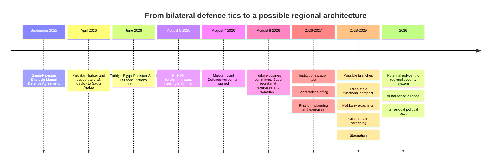
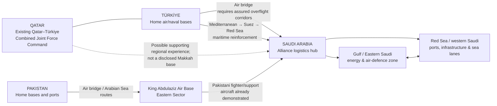

# The Makkah Defence Pact and the Rise of Polycentric Security Regionalism

## Executive summary

The **Makkah Joint Defence Agreement**, signed in Makkah on **August 7, 2026** by Saudi Crown Prince and Prime Minister Mohammed bin Salman, Turkish President Recep Tayyip Erdoğan, and Pakistani Prime Minister Shehbaz Sharif, is a genuine mutual-defence agreement, not merely a political communiqué. The official Saudi and Pakistani joint statements say that its purpose is to strengthen collective deterrence and that **an armed attack on any one of the three states is to be regarded as an attack on all three**. citeturn20search0turn20search1

The **full treaty text has not been publicly released or located in the official repositories examined for this report as of August 14, 2026**. That distinction is crucial. The public joint statement establishes the existence and central principle of the agreement, while Turkish Foreign Minister Hakan Fidan's subsequent official briefing provides the most detailed government explanation of how it is intended to work. Fidan said activation would require a request from the state under attack; that state would specify whether it needed intelligence, logistics, ammunition or, at the upper end, military units; a joint strategic political-military committee comprising the foreign ministers, defence ministers and chiefs of staff is envisaged; a permanent secretariat is to be based in Saudi Arabia; joint exercises and interoperability standards are planned; and additional states may eventually be admitted. citeturn21view2turn21view1turn22view2 Independent analysis published since the signing likewise notes that the treaty itself remains unpublished. citeturn25search2

The pact is therefore **substantially more consequential than a statement of friendship, but considerably less developed than NATO**. NATO's Article 5 similarly treats an attack on one as an attack on all while allowing each ally to take whatever action it “deems necessary”; what distinguishes NATO is the accumulated machinery behind that commitment—integrated command, operational planning, common standards, assigned forces, exercises, logistics and decades of institutional practice. citeturn15search0 The Makkah pact is only beginning to build such machinery. Fidan himself described the immediate task as taking “modest but concrete” institutional steps and explicitly identified interoperability, communications, logistics, threat analysis and intelligence sharing as work still to be done. citeturn21view1turn22view2

From a **grand-strategic** perspective, the pact is best understood not as an “Islamic NATO” but as the beginning of a **cross-regional security minilateral** linking the Gulf, Anatolia and South Asia. It advances three overlapping but not identical strategies:

| Member | Grand-strategic purpose of the pact | Principal constraint |
|---|---|---|
| **Saudi Arabia** | Reduce dependence on any single external security provider; convert financial power and geographic centrality into greater strategic autonomy; secure critical infrastructure; accelerate defence localization | Must preserve GCC cohesion, US security/technology ties and important relations with India and other partners |
| **Türkiye** | Build a “regional ownership” security architecture around itself while remaining in NATO; turn defence-industrial capacity into political influence; connect Middle Eastern and wider regional security structures | Risk of overextension and collision between Makkah obligations, NATO interests and Turkish disputes with Israel or Iran-related contingencies |
| **Pakistan** | Convert military capability and nuclear status into diplomatic, economic and defence-industrial influence; deepen Gulf access while pursuing a multipolar/geoeconomic strategy | India remains the principal military problem; Iran is a direct neighbour; fiscal constraints and domestic politics limit expeditionary commitments |

The military logic is genuinely complementary. Using the latest comparable full-year SIPRI estimates, the three states spent approximately **$125.1 billion on their militaries in 2025**: Saudi Arabia $83.2 billion, Türkiye $30.0 billion and Pakistan $11.9 billion. citeturn10view0 Saudi Arabia supplies money, infrastructure and a strategically central theatre; Türkiye supplies the strongest indigenous defence-industrial ecosystem and NATO-derived organizational experience; Pakistan supplies a substantial conventional military, an established Saudi deployment relationship and an estimated nuclear arsenal of about **170 warheads**. citeturn10view1turn26search1 Yet these strengths are not additive by default. Different equipment ecosystems, communications systems, doctrines, strategic priorities and geographically separated forces mean the alliance presently has much greater **potential capability** than **integrated capability**. Fidan's unusually frank emphasis on making different weapons and communications systems “talk” to one another underlines this gap. citeturn21view1

The pact's deepest significance is consequently institutional rather than arithmetical. It represents a possible movement toward **polycentric regionalism**: instead of one hegemonic security architecture, states simultaneously participate in overlapping arrangements—the GCC, NATO, OIC diplomacy, bilateral defence treaties, the informal Türkiye-Egypt-Pakistan-Saudi “R4,” and now the Makkah core. Türkiye explicitly describes this approach as “regional ownership,” while Fidan argues that Pakistan's inclusion takes the arrangement beyond a conventional definition of the Middle East. citeturn24search3turn22view2

My central forecast is that over the next three years the most likely outcome is **a functional but limited three-state security compact**, concentrating on integrated air and missile defence, intelligence, exercises, maritime security, logistics and defence industry rather than automatic participation in each other's major wars. An expanded architecture—most plausibly beginning with Egypt—is the second-most likely trajectory. A genuinely hard, NATO-like military alliance probably requires an external shock: a major attack followed by a successful invocation of the pact.

**Probability of the dominant institutional form:**

| Outcome | By Aug. 2027 | By Aug. 2029 | By Aug. 2036 |
|---|---:|---:|---:|
| Functional three-state compact | **55%** | **40%** | **25%** |
| Expanded “Makkah+” concentric architecture | **20%** | **30%** | **35%** |
| Crisis-hardened operational alliance | **15%** | **20%** | **20%** |
| Stagnant or largely symbolic pact | **10%** | **10%** | **20%** |

These are structured analytical judgments, not statistical forecasts.

The **nuclear dimension should be treated separately from the conventional alliance**. Pakistan's arsenal inevitably gives the pact a nuclear shadow, but neither the official joint statement nor Fidan's detailed explanation establishes a nuclear guarantee, nuclear planning body, deployment mechanism or extended-deterrence doctrine. Contemporary reporting also says Pakistani officials have resisted claims that nuclear weapons are automatically covered and that Saudi officials have denied that the agreement represents a nuclear-arms project. citeturn20search0turn21view2turn25search10 In present evidence, the correct formulation is **latent nuclear ambiguity, not a Pakistani nuclear umbrella**.

The larger strategic conclusion is that the Makkah pact is less evidence that the United States has “left” the Middle East than evidence that regional powers increasingly want **security portfolios rather than exclusive security patrons**. That is a subtler but potentially more durable transformation.

## Evidentiary baseline and treaty architecture

The analytical starting point has to be unusually strict because commentary surrounding the agreement has moved considerably faster than the publicly available legal documentation.

| Evidence | What it establishes | What it does **not** establish |
|---|---|---|
| **SPA joint statement, Aug. 7** | Agreement signed; collective-deterrence purpose; attack-on-one principle; comprehensive defence cooperation | Detailed decision rules, geography, force commitments, nuclear provisions, withdrawal clauses citeturn20search0 |
| **Pakistan PID joint statement, Aug. 7** | Independently confirms the same official wording from Islamabad | Additional implementation detail; text is essentially the summit communiqué citeturn20search1 |
| **Turkish MFA/Fidan briefing, Aug. 8** | Request-based activation; spectrum of aid; ministerial/military committee; Saudi secretariat; exercises; interoperability work; potential expansion | It is an executive interpretation, not a substitute for the unpublished treaty text citeturn21view2turn22view2 |
| **2025 Saudi-Pakistan Strategic Mutual Defence Agreement** | Demonstrates that mutual defence between Riyadh and Islamabad predates Makkah | Does not by itself determine Turkish obligations under Makkah citeturn7search1 |
| **Pakistani military deployment to Saudi Arabia, Apr. 2026** | Shows that at least one predecessor security guarantee produced an actual deployment of fighter and support aircraft | Public Saudi announcement does not disclose complete force size, rules of engagement or permanence citeturn26search1 |
| **Parliamentary/public reactions** | Political support exists, including from Pakistan's National Assembly leadership | No publicly located ratification instrument or detailed parliamentary treaty examination as of cutoff citeturn23search9 |

**The treaty is therefore real, but its legal-operational perimeter remains opaque.** I found no public full text on SPA, Pakistan's PID, Türkiye's MFA, or in the parliamentary/official-gazette searches conducted for this report. The absence matters because at least seven unresolved questions could materially alter the alliance's meaning: What territory is covered? Do attacks on deployed forces or merchant shipping qualify? How are proxy attacks attributed? Are cyberattacks included? Is a response decided by unanimity? Can a state fulfil its obligation with non-combat support? What are the accession and withdrawal provisions?

The best official evidence against the assumption of automatic war is Fidan's explanation. He said the country under attack must **request assistance**, and that the assistance requested may escalate from intelligence through logistics and ammunition to military units depending on the threat. citeturn21view2 This is consistent with the broader logic of collective defence: even NATO's Article 5 does not prescribe an identical military response by every ally. citeturn15search0

What makes Makkah potentially significant is the institutional architecture Fidan described. The proposed strategic political-military committee combines each country's foreign minister, defence minister and chief of staff; its decisions are to be implemented through a secretariat headquartered in Saudi Arabia; exercises, education, common standards, logistics, intelligence and defence-industrial cooperation are expected to follow. citeturn21view1turn22view2 These are exactly the areas in which a declaratory alliance either becomes militarily credible or remains a diplomatic shell.

The pact also has a meaningful prehistory. Saudi Arabia and Pakistan signed their Strategic Mutual Defence Agreement in September 2025, and in April 2026 Saudi Arabia officially announced the arrival at **King Abdulaziz Air Base in the Eastern Sector** of a Pakistani military force including fighter and support aircraft. citeturn7search1turn26search1 That matters more for credibility than rhetorical speculation: Riyadh and Islamabad have already demonstrated that a defence agreement can produce real force movement.

Türkiye-Pakistan cooperation likewise predates Makkah. The **CİNNAH-2026** joint commando and special-forces exercise was held from March 29 to April 10, 2026, and the two countries have a continuing naval-industrial relationship through the Pakistan MILGEM corvette program. citeturn26search0turn26search17 The new alliance is therefore best understood as **institutionalizing a triangle whose bilateral sides were already being thickened**.

A second prehistory is diplomatic. The Turkish MFA's 2026 listings record an R4 process involving Türkiye, Egypt, Pakistan and Saudi Arabia, and Fidan attended its fifth ministerial meeting in Amman on August 5—only two days before the Makkah signing. citeturn20search6turn20search10 On August 8, Fidan explicitly said the R4 would continue and described Egypt as a natural partner that he expected could eventually enter the defence alliance after technical issues were resolved. citeturn21view4turn22view2 That makes the separation between **R4 diplomatic regionalism** and the **three-state defence core** one of the most important features to watch.

The observed evolution can be represented as follows:

There has already been a useful reminder not to equate the clause with automatic activation. Two days after the pact was signed, the Houthis claimed an attack on the Jazan refinery in Saudi Arabia; no public invocation of the Makkah agreement followed. citeturn25news48 That does **not** prove the pact is weak—the incident may not have met whatever political or legal threshold the parties envisage—but it illustrates that attribution, scale, intent and a member's request will matter as much as treaty wording.

## Grand strategies of the three members

The pact works precisely because the three governments do **not** need identical motives. Alliances are often strongest when capabilities are complementary, but they become most fragile when the contingencies each member regards as existential diverge too far. Makkah contains both tendencies.

**Saudi Arabia: from protected state toward security-platform state.** Riyadh's strategic objective is not straightforward disengagement from Washington. It is better described as reducing **single-provider risk**. Saudi Arabia still benefits from Western technology, intelligence, training and military relationships, while simultaneously trying to build greater indigenous capacity and additional external partnerships. The General Authority for Military Industries reported that localization of Saudi military spending had reached **24.89% by the end of 2024**, toward a target above 50% by 2030, explicitly linking localization with strategic autonomy and defence independence. citeturn24search0

Makkah advances that objective in three ways. Pakistan can provide trained personnel, operational experience and relatively rapid augmentation; Türkiye can supply defence-industrial technology, drones, missiles, naval systems and organizational expertise; Saudi Arabia can finance procurement and host the alliance's institutional infrastructure. Fidan said defence-industry cooperation was among the subjects discussed most intensively by the leaders at Makkah. citeturn21view3 The pact thus allows Riyadh to move from being principally a **consumer of external security** toward becoming the financial and institutional hub of a regional security network.

The constraint is that Saudi Arabia already belongs to a defence architecture: the GCC. The GCC possesses a Joint Defence Council, a Unified Military Command, mechanisms for intelligence exchange, ballistic-missile early warning and joint air-defence planning. Following the September 2025 attack on Qatar, GCC ministers ordered intensified intelligence exchange, air-picture sharing, updated defence plans and joint air exercises. citeturn15search1 Bahrain therefore welcomed Makkah specifically as something that **complements**, rather than replaces, GCC joint defence. citeturn20search7

Saudi grand strategy consequently faces a balancing act: use Pakistan and Türkiye to augment Gulf deterrence without turning a Saudi-centered external network into a substitute for GCC collective institutions. If other GCC members perceive Makkah as a privileged Saudi parallel chain of command, the pact could weaken the very regional cohesion it seeks to strengthen.

**Türkiye: regional ownership without abandoning NATO.** Ankara's conceptual position is unusually explicit. Fidan has repeatedly described **“regional ownership”** as a core Turkish foreign-policy principle: regional states should organize stability themselves instead of leaving their security primarily to outside powers. In June 2026 he described this as a policy pursued not only in the Middle East but in the South Caucasus and Balkans. citeturn24search3 His post-Makkah explanation went further: Türkiye wants different security and economic architectures for the strategic basins around it—Middle East, Caucasus, Black Sea, Mediterranean, Balkans and Europe—and envisages these structures eventually being made mutually compatible. citeturn22view1

Makkah therefore fits a distinctly Turkish conception of **multi-regional strategic autonomy**. Ankara remains a NATO ally but seeks the ability to shape security environments that NATO does not organize. Fidan explicitly argued that the new agreement does not conflict with Türkiye's NATO responsibilities and said Ankara intends to borrow relevant NATO “best practices” for the new organization. citeturn21view2turn22view2

For Türkiye, defence industry is also an instrument of grand strategy. An alliance that adopts Turkish communications standards, drones, missiles, vehicles, ships or electronic-warfare technologies does more than create exports; it creates long-term training, maintenance, software, munitions and doctrinal relationships. The existing Pakistan MILGEM relationship and recurring Türkiye-Pakistan special-forces exercises illustrate how procurement and training can gradually create institutional familiarity. citeturn26search0turn26search17

The principal Turkish constraint is **strategic overextension**. Saudi and Pakistani leaders need not share Ankara's assessment of every Turkish dispute, especially a confrontation involving Israel or Turkish forces operating outside recognized Turkish territory. Türkiye must also maintain legal and political separation between its NATO commitments and its Makkah commitments. NATO Article 5 protects the treaty-defined alliance area; Saudi Arabia and Pakistan do not acquire NATO guarantees simply because Türkiye agrees to defend them. citeturn15search0

That makes Türkiye potentially the pact's **institutional bridge** and its principal source of alliance-management complexity simultaneously.

**Pakistan: turning military capital into geopolitical capital.** Pakistan's published National Security Policy 2022–2026 put economic security at the center of “comprehensive national security,” advocated a geo-economic vision alongside geostrategy, and described an emerging multipolar order as creating opportunities for Pakistan because of its location. citeturn24search2 Makkah fits that aspiration almost perfectly.

For decades Pakistan's military power has largely been assessed through the India-Pakistan balance. The Saudi relationship gives Islamabad another function: **security provider to a capital-rich Gulf partner**. Türkiye adds defence-industrial, technological and diplomatic depth. That can translate military expertise into training contracts, industrial projects, investment relationships and greater influence in Middle Eastern diplomacy.

The April 2026 deployment is strategically revealing because it demonstrates a model Pakistan can sustain more plausibly than large expeditionary wars: aircraft, personnel, air-defence or support elements deploying to defend Saudi territory and infrastructure under host-nation support. citeturn26search1 That is much more compatible with Pakistan's resources than an open-ended offensive campaign elsewhere in the Middle East.

But Pakistan faces the sharpest **entanglement dilemma** of the three members. Its principal conventional and nuclear planning remains connected to India; Iran shares a long land border with Pakistan; internal counterterrorism commitments consume military attention; and Pakistan's fiscal resources are substantially smaller than those of its partners. Its 2025 military expenditure of $11.9 billion was roughly one-seventh of Saudi Arabia's. citeturn10view0

Makkah therefore advances Pakistani grand strategy only if Islamabad can preserve a distinction between being a **defensive security provider** and becoming an automatically available expeditionary force for Gulf conflicts.

This produces a useful grand-strategic asymmetry:

> **Saudi Arabia wants strategic redundancy; Türkiye wants regional architecture; Pakistan wants strategic monetization and status.**

Those purposes are compatible below the threshold of major war. Whether they remain compatible during an India-Pakistan conflict, Türkiye-Israel clash or Saudi-Iran confrontation is the alliance's central unanswered question.

## Military credibility and strategic enablers

The Makkah members possess meaningful military complementarities, but the alliance's military potential should not be confused with an already integrated order of battle.

### Comparative capability assessment

| Attribute | Saudi Arabia | Türkiye | Pakistan | Implication for Makkah |
|---|---|---|---|---|
| **2025 military expenditure** | **$83.2bn** | **$30.0bn** | **$11.9bn** | Combined ≈ **$125.1bn**, but without a common budget or planning process the aggregate exaggerates immediately usable alliance power. citeturn10view0 |
| **Strategic military orientation** | Defence of kingdom, energy infrastructure, Gulf/Red Sea approaches; high-end air power and air defence | Large multi-domain NATO military; defence industry; ability to operate across several neighboring theatres | India-focused conventional and nuclear deterrence plus counterterrorism; established Saudi deployment relationship | Complementary orientations, but different threat priorities |
| **Nuclear forces** | No national nuclear arsenal publicly identified | No national nuclear arsenal; NATO membership is separate from Makkah | SIPRI estimate ≈ **170 warheads** | Gives pact nuclear *shadow*, not proven extended deterrence. citeturn10view1 |
| **Defence-industrial role** | Capital, procurement scale, localization drive; 24.89% localization reported for end-2024 | Broadest indigenous production base of the three; alliance-standard experience | Aerospace, land systems and munitions capacity; established industrial cooperation with Türkiye | Potentially powerful Saudi-finance/Turkish-technology/Pakistani-production triangle citeturn24search0turn21view3 |
| **Existing intra-pact operational link** | Hosted Pakistani force at King Abdulaziz Air Base | Recurring special-forces exercises with Pakistan; NATO planning experience | Already demonstrated deployment into Saudi theatre | Strong bilateral building blocks, weak trilateral integration so far citeturn26search1turn26search0 |
| **Forward access relevant to Gulf** | Home-theatre bases and ports | Existing Qatar-Türkiye Combined Joint Force Command | Saudi access demonstrated; Arabian Sea proximity | Saudi Arabia would be the natural logistics hub; Qatar offers Türkiye regional experience but is **not** automatically a Makkah facility. citeturn26search2 |
| **Principal critical gap** | Reliance on heterogeneous imported technology and external sustainment | Strategic lift/overextension; NATO-Makkah deconfliction | Fiscal capacity, strategic lift and India-centric force requirements | Sustainment, C4ISR, communications, IFF, common logistics and munitions matter more than headline force totals |
| **Most credible near-term contribution** | Bases, finance, air/missile defence infrastructure, sustainment | C2 practices, drones, maritime systems, defence industry, training | Aircraft, personnel, training, intelligence, potentially air defence | Favors defensive, networked missions rather than combined land warfare |

**Interoperability is the decisive variable.** The three members are not beginning from zero, but they are beginning from a collection of **bilateral interoperability islands**. Saudi-Pakistani forces have exercised and now deployed together; Pakistani and Turkish special forces train together; Türkiye and Pakistan have long-running naval-industrial cooperation. What has not yet been demonstrated publicly is a common three-state operational picture, integrated air-defence network, secure coalition communications architecture or combined headquarters. citeturn26search0turn26search1turn26search17

Fidan directly identified this problem. He said armies with different structures have to learn to work together and listed mutual training, support, logistics, threat analysis, intelligence sharing and defence industry as priorities. He specifically framed future exercises as necessary to determine how different weapons and communications systems would function together in a combat scenario. citeturn21view1

That makes **integrated air and missile defence** the most plausible first center of gravity for serious military cooperation. This is an analytical inference rather than an announced alliance plan, but it follows from the members' security environment and capability structure: Saudi Arabia's critical infrastructure is exposed to missiles and drones; Pakistan can contribute personnel, aircraft and potentially sensors or air-defence elements; Türkiye has a growing indigenous air-defence, sensor, drone and electronic-warfare industry; and defensive IAMD cooperation is politically easier than agreeing whose army will fight whose war. The existing Saudi-Pakistani air deployment provides a concrete foundation for such a model. citeturn26search1turn21view3

**Logistics is the second center of gravity.** The geographic triangle is large and non-contiguous. Saudi Arabia is geographically the natural receiving and sustainment hub, while Pakistan has relatively direct Arabian Sea–Gulf access. Turkish reinforcement of Saudi Arabia would depend on secure air corridors or maritime movement through the Mediterranean, Suez and Red Sea. Large sustained deployments would therefore require access agreements, host-nation logistics, strategic transport, spare parts, munitions and protected ports and airfields—not merely political authorization.

The following is a **schematic logistics diagram, not a representation of disclosed operational plans**:

The confirmed Pakistani deployment to King Abdulaziz Air Base and the separate existence of the Qatar-Türkiye Combined Joint Force Command make those two nodes relevant to capability analysis, but **there is no public evidence that Makkah has granted Türkiye a permanent Saudi base or converted Qatar into an alliance facility**. citeturn26search1turn26search2

In a prolonged high-intensity war, several limitations become more important than aggregate military spending.

First, **supplier heterogeneity** creates command-and-control and sustainment friction. Fidan's explicit concern over communications and weapons-system compatibility is the strongest official acknowledgement of this problem. citeturn21view1

Second, **strategic lift is finite**. Pakistan has demonstrated the movement of air assets into Saudi Arabia, but sustaining large formations over time would be much more demanding. Türkiye possesses meaningful expeditionary experience but would still need assured airspace, sealift and host-nation support for a large Gulf operation. These are logistical inferences from geography and the publicly known deployment architecture, not evidence of secret limitations or plans. citeturn26search1turn26search2

Third, **political interoperability** may be harder than technical interoperability. Shared radios can be purchased; shared definitions of aggression are harder. Saudi Arabia's threshold for supporting Pakistan against India may differ from Pakistan's threshold for supporting Saudi operations connected with Iran, just as Riyadh and Islamabad may distinguish between an attack on Turkish sovereign territory and a clash involving Turkish forces elsewhere.

### Nuclear implications

Pakistan's estimated arsenal gives Makkah a deterrent dimension no previous Saudi-centered alliance has possessed domestically. SIPRI estimates about **170 Pakistani nuclear warheads as of January 2026**. citeturn10view1 But the leap from “a nuclear-armed member belongs to the pact” to “Saudi Arabia and Türkiye are protected by Pakistani nuclear weapons” is analytically unjustified.

A credible extended nuclear guarantee normally requires at least some combination of nuclear consultation arrangements, defined red lines, survivable communications, operational planning, declaratory doctrine and confidence that the guarantor would accept nuclear risk on behalf of the protected state. None of those elements has been publicly demonstrated for Makkah. The public summit statement contains no nuclear language, while reporting around the agreement says officials have rejected portraying it as a nuclear project or arms-race mechanism. citeturn20search0turn25search10

The nuclear effect is therefore better conceptualized in three layers:

**Declaratory layer:** no public guarantee.

**Latent-deterrence layer:** adversaries know that Pakistan is nuclear-armed and cannot entirely exclude nuclear escalation in an existential crisis.

**Institutional layer:** presently absent in public evidence.

The most important nuclear indicator is consequently not another politician saying that Pakistan will “stand with” Saudi Arabia. It would be the appearance of a **formal strategic consultation group, explicit extended-deterrence language, nuclear command-and-control liaison, strategic-force exercises or basing arrangements**. Until such indicators emerge, Makkah should be assessed as a conventionally oriented pact with nuclear ambiguity in the background.

## Regionalism and external balances

The strongest analytical case for Makkah's importance is not that it creates a new bloc. It is that it may reveal the form that **post-hegemonic regional security organization** increasingly takes: overlapping, issue-specific, cross-regional and minilateral.

Türkiye's official conception of “regional ownership” is central here. Fidan argues that the Middle East requires indigenous security architecture before deeper economic integration can become durable, and he explicitly envisages different regional architectures eventually being connected to one another. citeturn22view0turn22view1 His observation that Pakistan takes Makkah beyond a conventional Middle Eastern geography is especially important. citeturn22view2 This is not classical regionalism based on a contiguous geographic organization. It is **functional regionalism** based on complementary capabilities.

The probable institutional structure is therefore best visualized as concentric rather than hierarchical:

**Makkah core → R4 political circle → GCC security institutions → wider OIC legitimacy → continuing NATO/US and bilateral partnerships.**

### GCC

Makkah does not begin in an institutional vacuum. The GCC already maintains mechanisms that the new pact still has to construct: a Unified Military Command, intelligence exchange, defence planning, air-operation coordination and ballistic-missile early-warning work. citeturn15search1 Bahrain's formal welcome of Makkah as complementary to GCC defence is therefore strategically revealing. citeturn20search7

The **positive trajectory** is division of labour: the GCC remains the Gulf's indigenous collective-defence architecture while Pakistan and Türkiye add external depth, defence industry, personnel and strategic mass.

The **negative trajectory** is institutional bypass: if Riyadh increasingly conducts urgent defence planning through Makkah rather than the GCC Unified Military Command, smaller Gulf states could view the arrangement as Saudi-centered hierarchy rather than Gulf collective security.

The interface between the future Makkah secretariat and the GCC Unified Military Command is consequently one of the highest-value indicators to watch.

### OIC and “Islamic NATO”

The pact's official statement deliberately invokes “brotherhood and Islamic solidarity,” so Islamic identity is part of its legitimating language. citeturn20search0 But institutionally Makkah was concluded among three states outside the OIC's decision machinery; the OIC remains a far broader political organization rather than the command structure for this defence commitment. citeturn15search2

That is why **“Islamic NATO” is a misleading analytical category**. Makkah does not represent Muslim-majority states collectively, excludes most of the Muslim world's largest states, includes no unified religious-security doctrine and is being constructed around national capability and strategic interest.

Islamic solidarity may supply political legitimacy. It does not yet supply military interoperability.

### NATO and Europe

Türkiye insists that the new agreement is compatible with NATO. Fidan said Ankara examined the issue legally and strategically and found no conflict, while also arguing that Makkah can learn from NATO's institutional practices. citeturn21view2turn22view2 NATO's treaty itself requires members not to enter international engagements conflicting with the North Atlantic Treaty, while Article 5 and Article 6 define NATO's own collective-defence obligations and geographical scope. citeturn15search0

Two implications follow.

First, **Saudi Arabia and Pakistan do not acquire NATO protection through Türkiye**. A Saudi-Pakistani conflict does not become a NATO conflict merely because Türkiye participates under Makkah.

Second, Türkiye could transmit useful NATO-derived organizational culture—planning procedures, exercise design, logistics practices and interoperability concepts—without transmitting NATO's legal guarantee.

This could make Makkah either a **bridge architecture**, compatible with Western standards, or a source of alliance-management problems if Türkiye is drawn into a conflict in which its NATO allies believe Ankara acted outside NATO's purposes.

### United States

A strong interpretation, represented by Steven Cook at the Council on Foreign Relations, is that Makkah demonstrates the end of a US-led regional order and a willingness by regional powers to shape security independently of Washington. citeturn25search2 There is genuine evidence for the decentralization argument, but “end of the US order” is too categorical at this stage.

The signatories themselves have emphasized defence, regional ownership and compatibility with existing partnerships rather than repudiation of those relationships. Fidan explicitly argues that the pact does not conflict with NATO. citeturn21view2

A better formulation is:

> **Makkah is evidence of the erosion of exclusive US-centered security dependence, not yet evidence of the disappearance of US power.**

For Washington, the pact is strategically ambiguous. A functioning Saudi-Turkish-Pakistani air-defence, maritime and counter-drone network could provide genuine burden-sharing. Conversely, if interoperability increasingly depends on non-US technologies and regional security decisions move into institutions where Washington has no seat, American political leverage and defence-industrial standard-setting power decline.

The optimal Western response is therefore engagement rather than hostility.

### Iran

Iran's initial reaction was more nuanced than the “Sunni bloc against Tehran” interpretation would predict. Iranian Foreign Ministry spokesperson Esmaeil Baghaei said there was no reason to assume the treaty was directed against Iran and framed the emergence of regional self-reliance as evidence that regional governments were reconsidering reliance on external security providers. citeturn25search11 Fidan likewise explicitly denied that Iran—or Israel—was designated as an enemy and argued that states not attacking members had nothing to fear from the pact. citeturn21view2

Iran nevertheless has strong reasons to monitor implementation. A Saudi-centered integrated air-defence system, Pakistani deployments and Turkish intelligence connectivity could substantially improve Gulf resilience against Iranian missiles or drones even without the alliance formally naming Iran.

This creates an important paradox: **Makkah's ideology of regional ownership overlaps with Tehran's own rhetoric about endogenous regional security, while its military effect could constrain Iranian coercive power.**

Whether Iran ultimately accommodates or opposes the architecture will therefore depend less on rhetoric than on basing, targeting doctrine, membership expansion and whether Tehran is offered institutional dialogue.

### Israel

Israel's strategic concern is different. A functioning Makkah architecture could give Türkiye greater backing in a regional crisis, while Saudi financing and Pakistani capabilities increase the potential scale of Turkish-led security arrangements. Yet the treaty's practical relevance to an Israel-Türkiye confrontation is highly contingent because the unpublished text leaves territorial and escalation thresholds unclear. Fidan's public position is that the alliance is defensive and does not designate Israel as a target. citeturn21view2

A direct attack on recognized Turkish territory would present Saudi Arabia and Pakistan with a very different political problem from an escalation involving Turkish forces deployed elsewhere. Until those distinctions are clarified, the pact probably increases **strategic uncertainty for Israel** more than it creates a credible three-state anti-Israel war plan.

### India

India is arguably the external actor for which the pact creates the most direct long-term alliance question. After the signing, India's External Affairs Ministry said it was examining the agreement from the standpoint of national security and regional peace and stability. citeturn25search4

For Pakistan, the benefit is obvious: uncertainty about Saudi or Turkish political, financial, intelligence or logistical assistance can marginally increase deterrence even without either partner committing combat forces.

But the alliance should not be interpreted as automatic Saudi-Turkish entry into an India-Pakistan war. Riyadh has strong independent interests with New Delhi, and the request-based implementation described by Fidan leaves substantial political discretion. citeturn21view2 The critical distinction in any South Asian crisis would be whether Saudi Arabia and Türkiye perceived Pakistan as suffering a clear external armed attack or as participating in an ambiguous escalation.

India's most effective response is thus not to treat Makkah immediately as an anti-India military bloc, which could make that outcome more likely, but to force clarification through sustained strategic dialogue with Riyadh and Ankara.

### China

China has not publicly endorsed the pact in an official alliance commitment, according to the sources reviewed, although Chinese state media have reported it and analysts note substantial congruence between Makkah's “regional ownership” logic and Beijing's preference for a less exclusively US-centered regional order. citeturn25search1

China can potentially benefit without assuming alliance obligations. Pakistan's close military relationship with China creates a pathway for Chinese-origin technology to become relevant to interoperability requirements, while Saudi demand for diversified defence technology creates commercial opportunities. citeturn25search1

But Beijing also has reason for caution. China values relations with Iran as well as Saudi Arabia and Pakistan. A Makkah pact that remains inclusive and defensive fits Chinese multipolarity; one that hardens into an explicitly anti-Iran coalition would complicate it.

### Russia

I located no authoritative Russian government statement specifically defining Moscow's position on the Makkah pact by the August 14 cutoff. Any assessment is therefore lower confidence.

The most plausible Russian reaction is ambivalent. **As an inference**, Moscow can welcome any reduction in exclusive Western control of Middle Eastern security, yet simultaneously dislike an expanded Turkish-centered architecture that increases Ankara's regional weight and potentially constrains Iran, one of Russia's important strategic partners. Türkiye's ability to maintain NATO membership while cooperating with Moscow in selected theatres already illustrates Ankara's practice of overlapping alignments. Fidan himself uses Türkiye's relationship with Russia to argue that participation in one alliance need not prevent mediation or cooperation with states outside it. citeturn22view1

The broader regionalism picture can therefore be summarized as:

| Institution / actor | Makkah's likely relationship |
|---|---|
| **GCC** | Complementary military depth if coordinated; competitive Saudi-centered structure if not |
| **OIC** | Source of broad Islamic legitimacy, not operational command |
| **R4** | Most plausible diplomatic pathway for expansion, particularly Egypt |
| **NATO** | Source of Turkish organizational know-how; separate legal guarantee |
| **United States** | Continued partner increasingly operating in a diversified security ecosystem |
| **Iran** | Potentially constrained militarily but ideologically able to endorse “regional ownership” |
| **Israel** | Faces increased uncertainty, especially through Türkiye; not yet a unified anti-Israel front |
| **India** | Gains a new Pakistan-linked uncertainty but not evidence of automatic Saudi-Turkish intervention |
| **China** | Potential beneficiary of multipolarity and defence diversification without needing to guarantee the pact |
| **Russia** | Likely welcomes decentralization of US influence but may resist Turkish expansion or anti-Iran hardening |

The deeper trend is consequently **institutional layering rather than bloc replacement**.

## Evolution scenarios and indicators

The probabilities below describe what I judge to be the **dominant institutional form** at each horizon. They sum to 100 percent across each time horizon. Because the agreement is only one week old and the treaty text is unavailable, uncertainty widens sharply toward 2036.

| Scenario | Aug. 2027 | Aug. 2029 | Aug. 2036 | Key triggers |
|---|---:|---:|---:|---|
| **Functional three-state compact** | **55%** | **40%** | **25%** | Saudi secretariat established; regular political-military committee; exercises; intelligence and IAMD cooperation; no transformative war |
| **Expanded “Makkah+” architecture** | **20%** | **30%** | **35%** | Egypt joins; membership criteria published; R4 becomes political outer ring; selected GCC or other states obtain observer/associate status |
| **Crisis-hardened operational alliance** | **15%** | **20%** | **20%** | Major armed attack; formal request for assistance; rapid multinational deployment succeeds; prepositioning and combined C2 follow |
| **Stagnant / hollow pact** | **10%** | **10%** | **20%** | First serious crisis exposes divergent interests; secretariat remains small; exercises symbolic; no common plans; leadership or fiscal changes reduce commitment |

**Functional compact — baseline case.** By August 2027, the most likely development is establishment of the Saudi-based secretariat, one or more meetings of the joint strategic political-military committee, a schedule of combined exercises and work on communications, intelligence and logistics. These priorities follow directly from Fidan's official implementation outline. citeturn21view1turn22view2 The alliance would become credible for air-defence reinforcement, intelligence, maritime surveillance, infrastructure defence and limited deployments, while remaining politically discretionary in major wars.

**Expanded Makkah+ architecture — most consequential institutional case.** Egypt is the obvious first candidate because it already participates with the three members in the R4 and Fidan publicly stated that he expects Egypt could join once technical issues are resolved. citeturn20search10turn21view4 Expansion beyond Egypt would become much more credible if the alliance publishes accession criteria, establishes observer categories or conducts exercises with prospective members.

The long-run importance of this scenario is that the architecture could become **concentric** rather than simply larger: a tightly integrated military core surrounded by politically associated states. That model would probably be more sustainable than trying to turn every interested Muslim-majority state into a full Article-5-style ally.

**Crisis hardening — the path from pact to alliance.** Alliances often acquire credibility through actual invocation. A large missile campaign against Saudi Arabia, a clearly attributable external attack on Turkish territory or a major attack on Pakistan could create precisely the political shock needed to establish combined headquarters, pre-positioned munitions and standing reinforcement plans. The earlier Pakistani deployment to Saudi Arabia demonstrates that rapid military assistance is not purely hypothetical. citeturn26search1

This scenario has the highest potential military impact because institutions that might otherwise take a decade can be created in months under wartime pressure. It also carries the greatest escalation risk.

**Stagnation — the underappreciated possibility.** The pact could survive ceremonially while acquiring little operational depth. The clearest route would be a crisis in which one member requests meaningful military support and the others decline, exposing divergent understandings of obligation. A Pakistan-India escalation, Türkiye-Israel clash outside Turkish sovereign territory or Saudi-Iran confrontation would each test different fault lines.

The fact that Fidan emphasizes request-based assistance helps preserve flexibility, but flexibility is double-edged: it lowers the political cost of joining while making deterrence less predictable. citeturn21view2

A **formal nuclearization pathway** is a separate low-probability tail risk rather than a mutually exclusive scenario. I assess the probability of an openly acknowledged Pakistan-Saudi-Türkiye nuclear-consultation mechanism at **no more than roughly 10 percent over the next three years**, rising toward **roughly 20 percent by 2036** if regional proliferation pressures intensify. Actual Pakistani nuclear weapons basing outside Pakistan would be substantially less probable on present evidence. These are analytical estimates, not claims about existing plans.

The most important indicators are highly observable:

| Indicator to watch | Signal strength | What it would mean |
|---|---|---|
| **Publication of full treaty or implementing protocol** | Very high | Clarifies legal scope, automaticity, accession and withdrawal |
| **Domestic ratification / formal entry-into-force notices** | High | Demonstrates institutional permanence beyond leader-level commitment |
| **Secretariat staffing, budget and legal personality** | Very high | Separates real organization from symbolic office |
| **First joint political-military committee meetings** | High | Establishes decision cycle and crisis-consultation mechanism |
| **Large trilateral command-post or field exercise** | Very high | Tests whether forces can plan and operate as an alliance |
| **Shared air picture / IAMD data links** | Very high | Strongest sign of genuine peacetime operational integration |
| **Common secure communications, IFF and standards** | High | Converts bilateral interoperability into trilateral interoperability |
| **SOFA, base-access or pre-positioning arrangements** | Very high | Signals preparation for sustained reinforcement rather than occasional visits |
| **Pre-positioned munitions or logistics stocks** | Very high | Major step toward a war-fighting alliance |
| **Joint procurement / production authority** | Medium-high | Creates durable industrial interdependence |
| **Egyptian accession or formal observer status** | Very high | Confirms transition from pact to regional architecture |
| **Formal interface with GCC Unified Military Command** | Very high | Indicates complementarity rather than institutional competition |
| **Nuclear consultation language or strategic-forces dialogue** | Exceptional | Would fundamentally alter deterrence assessment |
| **Clear US/NATO, Iranian, Israeli and Indian doctrinal reactions** | High | Reveals whether external actors are beginning to balance against the pact |

The single most diagnostic question over the next twelve months is therefore not “Will another country join?” It is:

> **Does the alliance create an operational planning cycle before it expands?**

Rapid membership growth without standards, planning and command mechanisms would make Makkah look more impressive politically while potentially making it less coherent militarily.

## Policy recommendations

The objective for outside governments should be neither to celebrate Makkah as a ready-made stabilizer nor to oppose it reflexively as an anti-Western bloc. Policy should aim to push the pact toward **transparent defensive regionalism** and away from opaque competitive alliance formation.

| Audience | Recommended approach | Strategic rationale |
|---|---|---|
| **United States and European NATO allies** | Treat the pact initially as a potentially complementary regional security layer; open structured dialogue with its secretariat once established | Hostility would reinforce the signatories' narrative that external powers resist regional ownership |
| **NATO** | Establish explicit deconfliction procedures with Türkiye concerning exercises, classified standards and crises outside NATO territory | Prevent ambiguity over where NATO obligations end and Makkah commitments begin |
| **Western defence partners** | Support defensive interoperability—air/missile defence, maritime awareness, counter-drone systems, HADR—while maintaining technology and end-use safeguards | Encourages stabilizing missions without underwriting offensive coalition warfare |
| **Makkah members** | Publish an interpretive declaration covering “armed attack,” territorial scope, decision procedures, proxy/cyber attacks and permitted forms of assistance | Predictability strengthens deterrence and reduces accidental escalation |
| **Saudi Arabia / GCC** | Build a formal liaison mechanism between the Makkah secretariat and GCC Unified Military Command | Prevents duplication and reassures smaller GCC states that Makkah augments rather than displaces Gulf institutions |
| **Türkiye** | Keep Makkah doctrine explicitly separate from NATO nuclear and collective-defence arrangements | Preserves credibility in both systems and avoids unintended treaty ambiguity |
| **Pakistan** | Define limits on expeditionary commitments and preserve an explicit distinction between Saudi territorial defence and offensive regional campaigns | Protects resources needed for South Asian deterrence and reduces Iran-related entanglement |
| **All three members** | Prioritize integrated air/missile defence, intelligence fusion, maritime security, logistics and communications before membership expansion | These provide the highest defensive return and force institutional learning |
| **Iran and Gulf regional states** | Create a parallel Makkah-Iran/GCC incident-prevention and missile-notification dialogue if political conditions allow | Limits security-dilemma effects even as defensive capacity rises |
| **Egypt and prospective members** | Seek observer/associate status before full mutual-defence accession unless command arrangements are already mature | Avoids adding treaty obligations faster than the alliance can operationalize them |
| **India** | Seek written or public clarification from Riyadh and Ankara regarding South Asian contingencies while expanding independent defence dialogue with both | Reduces worst-case assumptions without forcing Saudi Arabia or Türkiye to choose sides |
| **Other middle powers—Qatar, UAE, Oman, Indonesia and others** | Prefer modular participation in maritime security, exercises, disaster relief or industrial projects over immediate collective-defence commitments | Preserves strategic autonomy while shaping emerging institutions |

For the **United States**, the most counterproductive response would be to demand a binary choice between Washington and Makkah. The signatories' behavior instead reflects a world in which middle and regional powers increasingly hedge across institutions. Attempting to prevent that diversification would probably accelerate it. The better objective is to make Makkah **interoperable with a rules-based regional order without making it dependent on Western political control**.

For **Saudi Arabia**, institutional transparency is particularly important. The kingdom hosts the future secretariat and is simultaneously the pact member most deeply embedded in GCC institutions. Its decisions will determine whether Makkah becomes an extra layer of Gulf resilience or a competing center of gravity. Bahrain's explicitly complementary framing provides a useful model. citeturn20search7

For **Türkiye**, the strategic opportunity is to become the connective tissue between European and Middle Eastern security architectures—the role Fidan openly envisions. citeturn22view1 But that role requires disciplined separation between alliance systems. Attempts to imply that Türkiye can indirectly place Saudi Arabia or Pakistan beneath NATO's umbrella would damage both NATO credibility and Makkah credibility.

For **Pakistan**, nuclear ambiguity should be handled especially carefully. Islamabad receives some deterrent benefit merely because potential adversaries know it possesses nuclear weapons. Turning that ambiguity into expansive rhetorical promises could create expectations Pakistan has never established the institutional capability or political intention to fulfill. The strategically safer course is to build highly credible conventional assistance first.

The recommended sequencing for the pact itself is:

**institution → interoperability → logistics → defensive operational plans → crisis testing → expansion.**

Reversing that sequence—especially expanding membership before establishing common procedures—would maximize symbolism while minimizing military credibility.

## Methodology, limits, and source URLs

This report uses a **source hierarchy**. Official joint statements, foreign-ministry transcripts, defence-ministry announcements and intergovernmental treaty documents were treated as the primary evidentiary base. Recent wire-service and major analytical reporting were used mainly for external reactions, claims not contained in public government documents and competing interpretations. Think-tank commentary was used to test, rather than establish, the factual baseline.

The most important methodological distinction is between **what governments have committed to publicly** and **what analysts infer they intend**. The SPA/PID statement proves the collective-defence principle. Fidan's official transcript provides unusually detailed implementation guidance. It does not, however, allow us to reconstruct every provision of an unpublished treaty. citeturn20search0turn20search1turn21view2

The principal evidentiary gap is therefore the absence of the full Makkah Joint Defence Agreement. No public annexes, operational plans, status-of-forces agreements, rules of engagement, combined command document, membership criteria, ratification instruments or nuclear protocols were located in the official-source review completed through **August 14, 2026**. Any conclusion about those subjects is marked as an inference rather than presented as fact.

Military-spending comparisons use **SIPRI 2025 expenditure estimates**, the latest common full-year dataset available for all three states, rather than mixing national budget definitions. citeturn10view0 The nuclear estimate is likewise SIPRI's January 2026 open-source estimate and should not be interpreted as an official Pakistani declaration of arsenal size. citeturn10view1

The logistics diagram is intentionally schematic. It identifies publicly confirmed nodes and unavoidable geographic relationships but does not purport to reveal classified deployment routes or wartime plans.

Scenario probabilities are **structured analytic estimates** based on declared institutional intentions, pre-existing bilateral military cooperation, capability constraints, potential expansion pathways and likely crisis tests. Their purpose is to make assumptions falsifiable. They should be updated as the indicators listed above appear.

**Selected primary and authoritative source URLs:**

| Source | URL |
|---|---|
| Saudi Press Agency — Makkah Joint Defence Agreement joint statement | https://www.spa.gov.sa/en/N2649227 |
| Pakistan PID — Makkah Al-Mukarramah Summit for Joint Defence | https://pid.gov.pk/site/press_detail/33499 |
| Turkish MFA — Hakan Fidan interview explaining Makkah implementation, Aug. 8, 2026 | https://www.mfa.gov.tr/disisleri-bakani-sayin-hakan-fidan-in-anadolu-ajansi-editor-masasi-na-verdigi-mulakat--8-agustos-2026.tr.mfa |
| Pakistan PID — 2025 Saudi-Pakistan Strategic Mutual Defence Agreement | https://pid.gov.pk/site/press_detail/30371 |
| Saudi Press Agency — Pakistani military force arrives at King Abdulaziz Air Base, Apr. 2026 | https://www.spa.gov.sa/en/N2557387 |
| Turkish Defence Ministry — CİNNAH-2026 Türkiye-Pakistan joint exercise | https://www.msb.gov.tr/Basin-ve-Yayin/Aciklamalar/f4b2f616b43641d19df3a8355afb1014 |
| Turkish MFA — Qatar-Türkiye Combined Joint Force Command visit | https://www.mfa.gov.tr/sayin-bakanimizin-katar-i-ziyareti-19-mart-2026-doha.en.mfa |
| Saudi GAMI — military-spending localization | https://www.gami.gov.sa/en/news/gami-reports-localization-military-spending-saudi-arabia-increases-2489 |
| Pakistan National Security Policy 2022–2026 | https://nsd.gov.pk/SiteImage/Publication/NSP%20Policy.pdf |
| NATO — North Atlantic Treaty | https://www.nato.int/en/about-us/official-texts-and-resources/official-texts/1949/04/04/the-north-atlantic-treaty |
| GCC — Extraordinary Joint Defence Council statement | https://www.gcc-sg.org/en/MediaCenter/News/Pages/news2025-9-18-5.aspx |
| OIC — Charter | https://www.oic-oci.org/en/page/16 |
| SIPRI — World Military Expenditure 2025 | https://www.sipri.org/sites/default/files/Military%20Expenditure%202025.pdf |
| SIPRI — World Nuclear Forces, January 2026 | https://www.sipri.org/visualizations/2026/world-nuclear-forces-january-2026 |

The evidence currently supports a more precise conclusion than either “Islamic NATO” or “symbolic pact”: **Makkah is an embryonic cross-regional collective-defence institution whose strategic importance lies in whether it can turn three complementary national power bases into a persistent military organization.** Its most plausible future is not replacement of NATO, the GCC or the US security presence, but a **layered regional order in which several overlapping institutions coexist and states hedge among them**. The first serious request for assistance—and the institutional preparations made before that request arrives—will be far more revealing than the agreement's label.

navlistRecent reporting on the Makkah pact and its first regional teststurn25news47,turn25news48