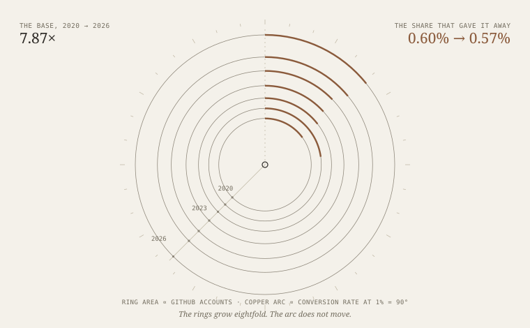
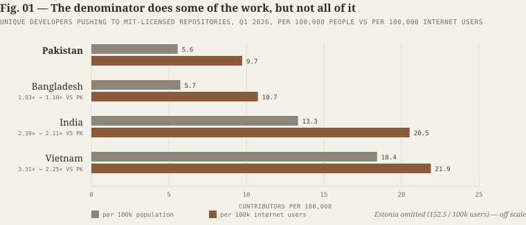
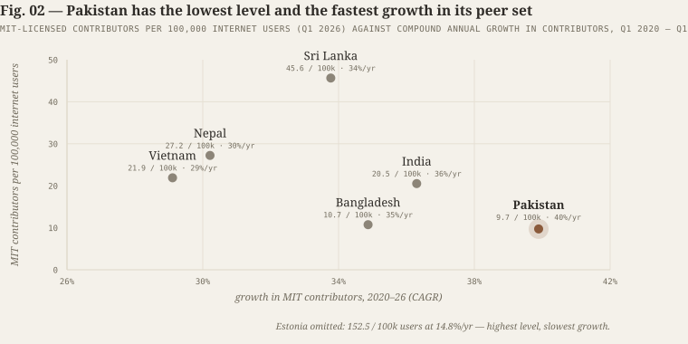
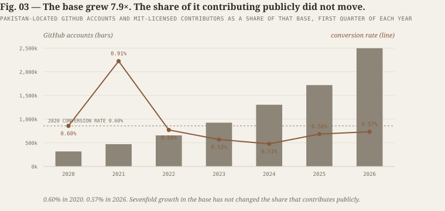
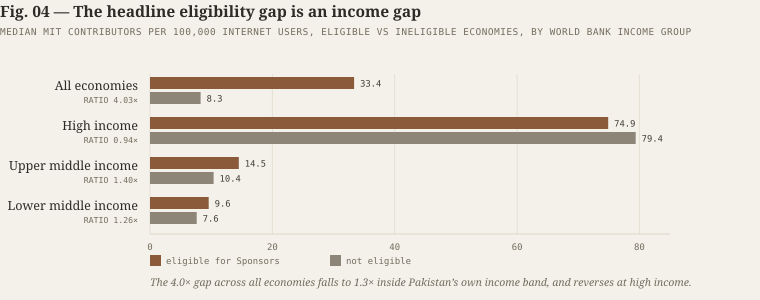
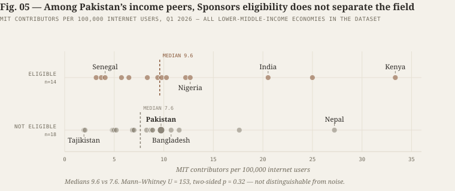

# Code Donation; situation of Pakistan's open source community

**Entry IV — Essay — September 2026**

*Pakistan built every input to an open-source economy except the one that pays for it.
Six years of growth has not fixed that, because growth was never the missing input.*

What the GitHub record says about why Pakistan produces developers at scale and public
code at a trickle — and why the most satisfying explanation for it does not survive its
own test.

**AI disclaimer** — Ideation by me, compilation by Astra.

*Ring area ∝ Pakistan-located GitHub accounts; the copper arc on each ring is that
year's conversion rate at 1% = 90°. The rings grow eightfold. The arc does not move.*

---

Count the Pakistani developers on GitHub and you get a triumph. Count the ones who
publish, and you get the same triumph, scaled down by a constant that has not moved
since 2020.

Between the first quarter of 2020 and the first quarter of 2026, the number of
GitHub accounts located in Pakistan rose from 317,224 to 2,497,496 — a 7.87×
increase, compounding at 41.0% a year.[^1] Over the identical window, the number of
Pakistani developers pushing code to at least one MIT-licensed repository rose from
1,896 to 14,211 — a 7.50× increase, compounding at 39.9% a year.[^2]

Those two numbers are, for practical purposes, the same number — and to the extent they
differ, public contribution grew 1.1 percentage points a year *slower* than the base.
Pakistan's open-source output has expanded in almost exact proportion to the number of
Pakistanis on the platform, and no faster. Six years of extraordinary growth produced no
intensity gain at all. Every additional contributor is explained by additional people
showing up; none is explained by Pakistanis becoming more likely to build in public.

This is the finding that should organise Pakistani technology policy, and it is
absent from it. The country's instruments — graduate production, skills trainings,
certification volume, company registration, export targets — all act on the base.
None acts on the ratio. The data now cover six years and an eightfold expansion,
which is enough to say with some confidence that acting on the base does not move
the ratio.

What follows tries to establish that claim carefully, and then to test the single
most attractive explanation for it. The explanation turns out not to survive. I
have kept it in the essay anyway, because the way it fails is more instructive than
the way it would have succeeded.

---

## I. First, fix the denominator

Before making any argument about a gap, it is worth asking whether the gap is partly
an artefact of measurement. Cross-country comparisons of developer activity are
routinely normalised by total population, which is the wrong denominator and
systematically flatters countries with high internet penetration.

Pakistan's internet penetration was 57.3% in 2024. Vietnam's was 84.2%, Estonia's
92.2%, India's 64.9%, Bangladesh's 53.4%.[^3] Dividing developer counts by total
population therefore charges Pakistan for the 43% of its people who are not online
and could not contribute to a public repository under any policy regime.

Recomputing against internet users rather than population changes the picture — but
not as much as one might hope.

*Fig. 01 — MIT-licensed contributors per 100,000, Q1 2026, computed against total
population and against internet users. Sources: GitHub Innovation Graph; World Bank.
Author's calculations.*

The Vietnam gap compresses from 3.31× to 2.25×, a reduction of roughly a third. The
India gap compresses from 2.39× to 2.11×. Against Bangladesh the correction runs the
other way and is worth stating plainly, because it is often reported backwards:
Pakistan is behind Bangladesh on *both* denominators, and the correction widens rather
than closes the gap. Bangladesh leads by 1.03× per head of population and by 1.10× per
internet user, because Pakistan's slightly higher penetration means more of its
population is already online and still not contributing.

This is the honest result. About a third of the apparent Pakistan–Vietnam gap is a
denominator artefact. Two-thirds of it is real. Any analysis reporting the raw
per-capita figure without this correction overstates the problem by roughly 30%; any
analysis using the correction to dismiss the problem overstates the fix.

Every cross-country figure in the rest of this essay is computed per 100,000 internet
users.

---

## II. Pakistan is winning the derivative and losing the level

The second common error is to read a low level as evidence of stagnation. Pakistan's
open-source contributor base is not stagnant. It is the fastest-growing in its peer
set, by a clear margin.

Between Q1 2020 and Q1 2026, Pakistan's MIT-licensed contributor count compounded at
39.9% a year. Over the identical window India grew at 36.3%, Bangladesh at 34.9%,
Sri Lanka at 33.8%, Nepal at 30.2%, Vietnam at 29.1%, and Estonia at 14.8%.[^2]

*Fig. 02 — Contribution intensity against contribution growth. Pakistan occupies the
bottom-right quadrant: lowest level, fastest growth. Sources: GitHub Innovation Graph;
World Bank. Author's calculations.*

Pakistan sits in the bottom-right quadrant — the position of a genuine
laggard-converger. This is good news, and it is the part of the story Pakistani
officials are entitled to tell.

It is not, however, a reason for patience, because the arithmetic of convergence is
brutal. Pakistan's growth advantage over Vietnam is 10.8 percentage points a year.
Applied to a 2.25× per-user gap, that closes the distance in roughly **ten years** —
around 2036, and only if Vietnam's rate holds and Pakistan's does not decay as its
base grows. Against India, where Pakistan's growth advantage is only 3.6 points, the
implied convergence horizon is **twenty-nine years**. Against Sri Lanka, whose rate is
6.1 points below Pakistan's but whose level is 4.7× higher, it is **thirty-five
years**.[^5a]

So the correct statement is neither "Pakistan is failing" nor "Pakistan is catching
up." It is: *Pakistan is converging on a timescale far longer than any of its stated
digital-economy targets, and closing that gap faster requires changing the rate, not
waiting on it.*

---

## III. The ratio that would not move

Six years is long enough for an experiment to finish. Pakistan ran one without
meaning to.

The default Pakistani policy reflex in technology is volume: more graduates, more
trainings, more certifications, more registered companies. The open-source data offer
an unusually clean natural experiment on whether volume works, because we can watch
the base grow nearly eightfold and ask what happened to the conversion rate.

*Fig. 03 — Pakistan-located GitHub accounts and the share of that base pushing to
MIT-licensed repositories, Q1 of each year. Source: GitHub Innovation Graph. Author's
calculations.*

Between Q1 2020 and Q1 2026, Pakistan's located GitHub accounts rose from 317,224 to
2,497,496. Over the same period the share of that base contributing to MIT-licensed
repositories went from 0.60% to 0.57%. It spiked to 0.91% in 2021, fell to 0.51% by
2024, and has partially recovered. The trend line is, for practical purposes, flat.[^1]

Two caveats belong here rather than in a footnote.

The first is that this ratio divides a quarterly *flow* of contributors by a
cumulative *stock* of accounts. Because account stocks age and accumulate dormant
members, a mechanically declining ratio would be the naive expectation; a flat ratio
is therefore very mildly better than nothing. The second is that the 2021 spike
almost certainly reflects pandemic-era conditions rather than a policy effect, and
should not be treated as a target that Pakistan once hit and then lost.

Neither caveat rescues the headline. The cleanest statement does not depend on the
ratio at all: contributors grew 7.50× while the base grew 7.87×, measured the same
way at both endpoints. Public contribution has tracked the base almost exactly.

Six years of extraordinary growth in the developer base produced no improvement in
the rate at which that base converts into public contribution. Whatever governs the
conversion rate, it is not the size of the pool.

This should discipline the policy response more than any cross-country comparison in
this essay. Pakistan does not need another order-of-magnitude expansion in graduate
production to get an order-of-magnitude improvement in open-source capacity. It needs
to change a ratio that has not moved in six years — and adding people to the base has
demonstrably not done it.

---

## IV. The most attractive explanation, and why I am not going to sell it to you

There is a clean, mechanical, verifiable explanation available for why Pakistani
developers do not convert into public contributors, and I want to present it at full
strength before explaining why I do not believe it carries the weight.

GitHub Sponsors is the largest single mechanism by which individual open-source
maintainers receive money for their work. GitHub's documentation is explicit:
"Anyone in any region can sponsor eligible maintainers, but you must reside in a
supported region to receive funds."[^4] The supported list runs to 103 regions. It
includes India, Vietnam, Estonia, Sri Lanka, Indonesia, Malaysia, the Philippines,
Singapore, Thailand and Cambodia.

It does not include Pakistan. It does not include Bangladesh.

That fact appears in no Pakistani policy document I could find, and it is not
trivial. A Pakistani maintainer who builds a widely used library and attracts sponsors
cannot collect. Unlike "curriculum gaps" or "cultural preferences," this is not a soft
variable requiring a behavioural story. It is a hard gate with no intermediate step to
theorise.

It also explains a specific anomaly that other theories do not. Pakistan ≈ Bangladesh
is a strange result on every conventional metric — Pakistan has more graduates, more
exports, more policy attention and a larger ecosystem. It is not a strange result if
the binding constraint is a payment rail closed to both and open to their comparators.

This is the argument the earlier draft of this essay made, and made as its central
thesis. It is wrong, or at least unsupported, and the test that shows it is
straightforward.

### The test

The claim above rests on five observations. Five is not a sample. The GitHub
Innovation Graph and the Sponsors region list are both public, so the hypothesis can
be tested against every economy in the dataset rather than a hand-picked set.

Matching the licence data to World Bank population and internet-penetration figures
yields 140 economies with complete data: 97 eligible for Sponsors, 43 not. Across all
140, the median eligible economy records 33.4 MIT contributors per 100,000 internet
users against 8.3 for the median ineligible economy — a ratio of 4.03×. On its face
that is a powerful result.

It is also almost entirely an income effect. Sponsors eligibility tracks payment-processor
coverage, anti-money-laundering posture and financial-compliance geography, all of which
correlate strongly with national income. Eligible economies are richer, and richer
economies contribute more to open source for many reasons that have nothing to do with
GitHub.

Conditioning on World Bank income group dissolves most of the effect.

*Fig. 04 — Median MIT contributors per 100,000 internet users, eligible vs ineligible
economies, by World Bank income group. Sources: GitHub Innovation Graph; GitHub Docs;
World Bank. Author's calculations.*

Among high-income economies the gap reverses: ineligible economies post a *higher*
median (79.4 vs 74.9). Among upper-middle-income economies it falls to 1.40×. Among
lower-middle-income economies — Pakistan's actual peer group — it falls to 1.26×,
medians of 9.6 against 7.6.

That remaining difference is not distinguishable from noise. A Mann–Whitney rank-sum
test on the 32 lower-middle-income economies returns U = 153 with a two-sided
permutation p of 0.32. For upper-middle-income economies, p = 0.11. Neither approaches
conventional significance.

*Fig. 05 — Every lower-middle-income economy in the dataset, ranked by contribution
intensity and shaded by Sponsors eligibility. The two groups interleave. Sources:
GitHub Innovation Graph; GitHub Docs; World Bank. Author's calculations.*

The individual cases make the point more vividly than the medians. Nepal is
ineligible, poorer than Pakistan, has internet penetration of 46.3% against Pakistan's
57.3%, and records 27.2 MIT contributors per 100,000 internet users — 2.8× Pakistan's
9.7. Lebanon is ineligible and posts 17.6. Zambia is ineligible and posts 11.6. In the
other direction, Senegal, Côte d'Ivoire, Tanzania, Namibia, Uzbekistan and Ghana are
all eligible and all sit below Pakistan.

Sri Lanka is the case that should trouble Pakistani policymakers most, and it does not
require the eligibility story at all. Sri Lanka has internet penetration of 54.6% —
slightly *below* Pakistan's — a population of 21.8 million against Pakistan's 255
million, and a far smaller software sector. It records 45.6 MIT contributors per
100,000 internet users, 4.7× Pakistan's rate.[^5]

### What I conclude

The gate is real. What I cannot show is that it is load-bearing. Pakistan's exclusion
from GitHub Sponsors is verifiable, undocumented in Pakistani policy, and worth fixing on
its own terms — a removable friction on exactly the population most likely to become
maintainers. But the cross-national evidence does not support treating it as the binding
constraint, and an essay that led with it would be selling a single-cause story that its
own data refute.

I would add one methodological note in its favour, because the test is not decisive
either. Eligibility is an economy-level binary applied to a heavily skewed outcome with
small within-band samples; a real effect of the size plausibly at stake here would be
hard to detect at n = 32. The test does not show that the gate does not matter. It shows
that the gate cannot carry an argument by itself, which is a weaker and more defensible
claim.

The flat conversion rate in Fig. 03 needs no cross-country inference at all. It is the
more robust finding, and the rest of this essay is built on it.

---

## V. Where the hours actually go

If Pakistani developer time is not going into public repositories, it is worth asking
where it is going. The answer is not idleness.

Pakistan's ICT exports reached a record $4.6 billion in FY2025-26, up 21% year on
year, producing an ICT trade surplus of $3.9 billion — though still roughly $400
million short of the government's own $5 billion target.[^6] Within that total,
Pakistani IT freelancers earned about $1.16 billion, up 49% from $779 million the
previous year, and roughly a quarter of national IT export earnings. Total freelancer
foreign-exchange receipts, across all categories rather than IT alone, reached about
$1.76 billion.[^7]

That freelancer billion is the most analytically interesting number in Pakistan's
technology economy. It represents a large population of individual developers working
without institutional employment, selling hours directly into global markets, and
successfully getting paid across borders. This is precisely the demographic that in
Vietnam or India supplies a meaningful share of open-source contribution.

In Pakistan it does not, and the reason is not mysterious. For a freelancer, an hour
spent on a client deliverable has a market price and a functioning collection
mechanism. An hour spent maintaining a public dependency has neither. Faced with that
spread, the freelancer sells the hour. This is not a failure of civic spirit. It is
arithmetic.

Note that this mechanism does not require the Sponsors gate to be binding. It requires
only that domestic demand for public code is approximately zero, which is separately
demonstrable and is the subject of the next section.

The standard caveat here is that the Innovation Graph observes only public activity, so
some portion of Pakistan's apparent deficit is real work hidden inside private client
repositories. That caveat is correct and it strengthens the argument rather than
weakening it: the missing output is not missing capability, it is capability that has
been routed into private appropriation because the public route does not pay.

---

## VI. The institutional void, stated precisely

Pakistan's policy documents are not hostile to open source. The Digital Pakistan Policy
of 2018 contains a dedicated Section 8, "Open Source," with three clauses: enhance
government capacity to evaluate open-source ICT products; "Ensure fair consideration of
both types of software i.e. open source and proprietary during the procurement process";
and "Encourage R&D of 'Open Source' across the country through appropriate means."[^8]

That is the entirety of it. No target, no owner, no timeline, no budget line.

The contrast with India is not one of enthusiasm but of machinery. India's *Policy on
Adoption of Open Source Software for Government of India* states at Clause 4, under
"Nature of Compliance," a single word: **Mandatory**. Clause 6 requires that government
organisations "must include a specific requirement in Request for Proposal (RFP) for all
suppliers to consider OSS along with CSS while responding," and that "Suppliers shall
provide justification for exclusion of OSS in their response."[^9]

India's policy is weaker than its reputation — its core verb in Clause 3 is "shall
endeavour to adopt," which is hortatory language inside a mandatory wrapper, and Clause 7
provides broad exceptions. But it creates a procurement obligation that generates
paperwork, and paperwork generates compliance. "Fair consideration" generates nothing.

On the institutional side, Pakistan's position is weaker than even sympathetic accounts
suggest. I checked the three organisations usually named as the country's open-source
community infrastructure, via the GitHub API, on 19 September 2026:[^10]

- **Open Source Foundation Pakistan** (`github.com/osfp-Pakistan`) holds 206 public
  repositories. The organisation profile was last updated in September 2019. It has 19
  followers. Its repository count is substantially an artefact of forking rather than a
  measure of production.
- **Open Source Software Pakistan** (`github.com/OSSpk`) has **one** public repository
  and was last updated in December 2024. It has 145 followers.
- **Code for Pakistan** (`github.com/codeforpakistan`) is the exception. Created in May
  2013, it holds 261 public repositories and was active as recently as 12 September 2026.
  It is a genuine, functioning civic-technology institution.

So the accurate statement is not that Pakistan has "at least two open-source foundations
plus informal groups." It is that **Pakistan has one living open-source institution of
national significance, and it is a civic-tech nonprofit that was not designed to be the
country's open-source community body.**

One further data point closes the argument about institutional priority. The Pakistan
Software Export Board's Annual Report for January–December 2025 runs to 85 pages and
covers skills programmes, export promotion, company registration, and the flagship
SkillTech Pakistan initiative targeting 430,000 advanced digital-skills trainings over
three years in partnership with Huawei and ZTE. A full-text search of that report for
the phrase "open source" returns **zero matches**.[^11]

That is not thin support. That is absence.

---

## VII. What follows

If the binding constraint is the conversion rate rather than the size of the base, the
intervention set changes shape. Exhortation, curriculum reform and awareness campaigns
act on a margin that is not binding. What is needed is domestic demand for public code,
and a route by which building it pays.

The ordering below reflects the evidence, including the part of the evidence that
weakened my own preferred hypothesis.

**One: use procurement, because it is the only lever that creates guaranteed demand.**
This is now the highest-priority item rather than the payment rail. Pakistan should move
from "fair consideration" to an India-style requirement that custom, taxpayer-funded
government software be evaluated for open release, with written justification when source
cannot be published. The distinction that matters is not proprietary versus open in
general, but *commodity products* versus *custom software the public has already paid for
once*. Contracts should assign the government sufficient rights to publish, and should
budget for maintenance past delivery. This creates paid work for public code inside
Pakistan, which no external platform decision can veto.

**Two: build the domestic payment substitute now, rather than waiting.** A maintenance
fund that pays Pakistani developers, in rupees, through domestic banking, for upstream
contributions to projects that Pakistani institutions actually depend on, requires
nobody's permission. It should pay for the unglamorous work — dependency upgrades,
release engineering, security response, documentation, localisation, packaging — and it
should pay for contributions to *international* projects Pakistan relies on, not only
software invented locally. Credibility in open source is earned by maintaining what
others use.

**Three: treat the payment rail as infrastructure policy, not a technology-company
problem.** The State Bank, the Ministry of IT and PSEB should pursue Sponsors and
equivalent-platform eligibility as a named objective with an owner and a deadline, in the
same way market-access barriers are pursued for any other export sector. This is a
financial-compliance and diplomatic task, not a software task. I rank it third rather
than first because the evidence in Section IV does not support treating it as decisive —
but it is cheap, it is tractable, and every maintainer-career initiative built on a rail
that stops at the border has a hole in the middle of it.

**Four: attach open source to a programme that already exists rather than inventing one.**
SkillTech Pakistan is already running at 430,000-training scale with named delivery
partners. An open-source practicum requiring accepted upstream contributions — to a real
project, with a real issue tracker, a real review process, and an external maintainer — is
a modification to an existing programme, not a new budget line. Documentation,
localisation, testing and security fixes should count as contributions alongside code.

**Five: measure the ratio, not the volume.** Pakistan measures exports, registrations,
trainings and certifications. It does not measure repeat contributors, maintainers,
accepted upstream pull requests, public-sector repositories released, or dependencies under
Pakistani maintenance. The Innovation Graph provides a free, reproducible baseline for the
first of these. The conversion rate in Fig. 03 is the single number a Pakistani open-source
strategy should be judged against, and it currently sits where it sat in 2020.

---

## VIII. Predictions, so this can be wrong

An argument that cannot fail is not an argument. Five falsifiable claims follow from the
diagnosis above, and the first two are the ones that would hurt most if they failed.

1. **Absent a procurement rule or a domestic maintenance fund, Pakistan's MIT conversion
   rate will remain between 0.50% and 0.65% through Q1 2030**, regardless of graduate
   output, because that is what it has done through an eightfold expansion of the base.
2. **Curriculum-only and training-only interventions will move contributor counts but not
   the conversion rate.** More students pushing to GitHub raises numerator and denominator
   together.
3. **If Pakistan gains GitHub Sponsors eligibility and nothing else changes, the conversion
   rate will rise by less than 0.10 percentage points within eight quarters.** This is the
   prediction that distinguishes my position from the earlier draft's; if the rate jumps,
   the payment-gate thesis was right and I was wrong to demote it.
4. **Bangladesh will continue to track Pakistan closely on per-user contribution intensity**,
   because the two economies share the relevant structural features, not merely the
   ineligibility.
5. **Sri Lanka, eligible and twelve times smaller, will retain a contribution-intensity lead
   over Pakistan through 2030** unless Pakistan creates domestic demand for public code.

---

## The bottom line

Pakistan has built the supply side of an open-source ecosystem and none of the demand
side. It produces the developers. It does not buy the public good they could make.

The country's instinct, when confronted with this, will be to train more people. The data
in Fig. 03 say plainly that this will not work: the base grew nearly eightfold and the
conversion rate did not move. The binding constraint is not how many Pakistanis can write
software. It is that writing software for the commons pays a Pakistani developer nothing,
and that no Pakistani institution — not the Ministry, not PSEB, not the universities — is
currently on the other side of that transaction.

The most satisfying version of this argument would have been the payment rail: a single
hard gate, externally imposed, mechanically decisive. I tested it and it did not hold up.
What remains is less dramatic and more actionable, because it is entirely within Pakistan's
own control. Nobody outside the country needs to grant permission for the state to start
buying public code.

Open source is the one place where reputation, strategic autonomy and reusable
infrastructure can be accumulated without first accumulating capital. A country can
donate its way into the infrastructure other countries depend on. Pakistan has the
donors. Nobody has asked them.

---

## Notes on sources and method

All GitHub figures are from the GitHub Innovation Graph, which publishes quarterly
economy-level data as raw CSVs in a public repository. Figures were retrieved on
19 September 2026 and reflect the Q1 2026 release. All per-capita, growth, ratio and
significance calculations are the author's, computed directly from those primary CSVs and
from World Bank population and internet-penetration data via the World Bank API. None are
taken from secondary reporting.

### Verification ledger

Claims in this draft were checked directly against primary sources. Specifically verified:

- All MIT contributor counts and GitHub account counts, recomputed from the Innovation
  Graph CSVs.
- Population and internet-penetration figures, retrieved from the World Bank API.
- The GitHub Sponsors supported-region list (103 entries) and the eligibility sentence,
  read from the GitHub Docs source file.
- The Digital Pakistan Policy Section 8 clauses, read from the PDF hosted by the Ministry
  of Information and Broadcasting.
- India's OSS policy Clauses 3, 4, 6 and 7, read from the MeitY PDF.
- The three GitHub organisation profiles, queried via the GitHub REST API.
- The PSEB Annual Report 2025 full-text search results, run against the 85-page PDF.
- Pakistan's FY2025-26 ICT export and freelancer earnings figures, cross-checked across
  multiple outlets reporting the IT Minister's and PSEB's statements.

**Carried forward from the underlying research memo but *not* independently verified by me,
and therefore used sparingly or not at all in this draft:** HEC's "75,000+ annual IT
graduates" figure; the 2026 National Skill Competency Test results; Ignite and MoITT
programme budgets; Estonia's *koodivaramu.eesti.ee* national code repository; Bangladesh's
e-Service Bus open-source composition. Each should be confirmed before publication if it is
to be cited.

**Two claims in the research memo did not survive verification and have been dropped.** The
memo states that PSEB "explicitly lists 'open source technologies' among specialized fields
it seeks to develop"; the phrase does not appear anywhere in PSEB's Annual Report 2025. The
memo's "600,000+ IT/ITeS professionals" workforce figure likewise does not appear in that
report — the string "600,000" returns zero matches — and it is not used here.

### Known limitations, stated rather than buried

- The Innovation Graph observes only *public* activity on GitHub. Private repositories,
  self-hosted Git and GitLab are invisible. Pakistan's true software output is larger than
  these figures show.
- GitHub assigns location from user activity, not nationality. Diaspora developers and VPN
  users are misattributed in both directions.
- Developer-account counts include inactive accounts. The conversion ratio divides a
  quarterly flow by a cumulative stock and its *level* should not be over-interpreted; its
  *trend*, and the near-identical growth rates of numerator and denominator, are the load-bearing
  results.
- Licence categories overlap. A developer pushing to MIT, Apache and GPL repositories in one
  quarter appears in all three. The MIT count is used throughout as a consistent lower-bound
  proxy and is never summed with other licences.
- The licence dataset suppresses economy-quarter cells below roughly 100 pushers — the
  minimum observed value in the file is 101 — which truncates small economies and biases the
  cross-country sample toward larger ones.
- Population and internet users are denominators of convenience. Neither is a working-age or
  tertiary-educated denominator.
- The eligibility analysis covers 140 economies with complete data. Within-income-band sample
  sizes are small (n = 32 for lower-middle-income), so the null result is evidence against a
  *large* effect, not evidence of no effect.
- World Bank internet-penetration data are 2024; population data are 2025; GitHub data are
  Q1 2026. The series are not perfectly contemporaneous.

---

[^1]: GitHub Innovation Graph, `developers.csv`, Q1 2020 – Q1 2026.
    <https://github.com/github/innovationgraph/blob/main/data/developers.csv> — Pakistan-located
    accounts, Q1 of each year: 317,224 (2020); 470,394 (2021); 656,514 (2022); 924,871 (2023);
    1,303,816 (2024); 1,718,562 (2025); 2,497,496 (2026). Conversion rate by year, computed against
    `licenses.csv`: 0.60%, 0.91%, 0.58%, 0.53%, 0.51%, 0.56%, 0.57%. Retrieved 19 September 2026.

[^2]: GitHub Innovation Graph, `licenses.csv`, Q1 2020 and Q1 2026.
    <https://github.com/github/innovationgraph/blob/main/data/licenses.csv> — MIT pushers, Q1 2026:
    Pakistan 14,211; Bangladesh 10,081; India 195,150; Vietnam 18,721; Estonia 1,922; Sri Lanka 5,421;
    Nepal 3,734. Q1 2020: Pakistan 1,896; India 30,436; Bangladesh 1,675; Vietnam 4,042; Estonia 841;
    Sri Lanka 946; Nepal 766. CAGR computed over six years. Retrieved 19 September 2026.

[^3]: World Bank, *Individuals using the Internet (% of population)*, indicator `IT.NET.USER.ZS`, 2024:
    Pakistan 57.25, India 64.94, Bangladesh 53.42, Vietnam 84.15, Estonia 92.24, Sri Lanka 54.59,
    Nepal 46.30. Population, indicator `SP.POP.TOTL`, 2025: Pakistan 255,219,554; India 1,463,865,525;
    Bangladesh 175,686,899; Vietnam 101,598,527; Estonia 1,366,475; Sri Lanka 21,756,000.
    <https://api.worldbank.org/v2/country/PAK;IND;BGD;VNM;EST;LKA/indicator/IT.NET.USER.ZS>

[^4]: GitHub Docs, "About GitHub Sponsors," supported-regions section.
    <https://github.com/github/docs/blob/main/content/sponsors/getting-started-with-github-sponsors/about-github-sponsors.md>
    — "Anyone in any region can sponsor eligible maintainers, but you must reside in a supported region
    to receive funds." List comprises 103 regions; Pakistan, Bangladesh, Nepal, China and Taiwan are
    absent. Retrieved 19 September 2026.

[^5]: Full-sample eligibility analysis: 140 economies with complete GitHub, population and
    internet-penetration data (97 eligible, 43 ineligible). Median MIT contributors per 100,000 internet
    users — all economies: 33.4 eligible vs 8.3 ineligible (4.03×); high income: 74.9 vs 79.4 (0.94×);
    upper-middle income: 14.5 vs 10.4 (1.40×, two-sided permutation p = 0.11); lower-middle income:
    9.6 vs 7.6 (1.26×, Mann–Whitney U = 153, two-sided permutation p = 0.32, n = 32). Income groups per
    World Bank classification. Author's calculations; underlying panel included alongside this draft as
    `eligibility-panel-q1-2026.json`.

[^5a]: Convergence horizons solve (1+g_PK)^t / (1+g_peer)^t = current per-user gap, using the CAGRs in
    note 2 and the per-user levels in Fig. 01. Vietnam: 2.25× gap, +10.8pp advantage, t = 10.1 years.
    India: 2.11×, +3.6pp, t = 28.7. Sri Lanka: 4.69×, +6.1pp, t = 34.6. Bangladesh: 1.10×, +5.0pp,
    t = 2.7. These assume constant growth rates and are illustrative of the arithmetic, not forecasts;
    Pakistan's rate will almost certainly decay as its base grows, which lengthens every horizon above.

[^6]: "Pakistan's ICT exports hit record $4.6 billion in FY2025-26, minister says," Arab News Pakistan.
    <https://www.arabnews.pk/node/2651367/pakistan> — $4.6bn, up 21% on FY2024-25; ICT trade surplus
    $3.9bn, up 18%; approximately $400m short of the $5bn target.

[^7]: "Pakistani Freelancers Earn Record $1.76 Billion in FY26," ProPakistani.
    <https://propakistani.pk/2026/07/20/pakistani-freelancers-earn-record-1-76-billion-in-fy26/> — total
    freelancer foreign exchange $1.76bn, up 78% from $984m; IT freelancers $1.16bn, up 49% from $779m.
    PSEB's Top Freelancer Award materials cite $1.1bn contributed to IT/ITeS exports, roughly 25% of the
    $4.6bn total. The three figures use different definitions and should not be used interchangeably.

[^8]: Government of Pakistan, Ministry of IT & Telecom, *Digital Pakistan Policy*, 22 May 2018,
    Section 8 ("Open Source"), clauses 8.1–8.3; implementation matrix assigns "Open Source — Skills &
    Capabilities" to the Ministry of IT & Telecom.
    <https://moib.gov.pk/Downloads/Policy/digital_pakistan_policy(22-05-2018).pdf> — text extracted and
    verified 19 September 2026.

[^9]: Government of India, Department of Electronics & Information Technology, *Policy on Adoption of
    Open Source Software for Government of India*, F. No. 1(3)/2014 – EG II. Clause 3 (Policy Statement:
    "shall endeavour to adopt Open Source Software in all e-Governance systems … as a preferred option");
    Clause 4 (Nature of Compliance: "Mandatory"); Clause 6 (How to comply); Clause 7 (Exception).
    <https://www.meity.gov.in/static/uploads/2024/02/policy_on_adoption_of_oss.pdf> — text extracted and
    verified 19 September 2026.

[^10]: GitHub REST API, organisation endpoints, retrieved 19 September 2026.
    `api.github.com/orgs/osfp-Pakistan` — 206 public repos, created 2015-02-17, profile updated
    2019-09-26, 19 followers. `api.github.com/orgs/OSSpk` — 1 public repo, updated 2024-12-04, 145
    followers. `api.github.com/orgs/codeforpakistan` — 261 public repos, created 2013-05-13, updated
    2026-09-12, 150 followers.

[^11]: Pakistan Software Export Board, *Annual Report, January–December 2025*, 85pp. Full-text search
    for "open source" / "Open Source" / "open-source" returns zero matches; search for "600,000" returns
    zero matches. SkillTech Pakistan described as launched September 2025, targeting 430,000 advanced
    digital-skills trainings over three years, with Huawei and ZTE partnerships. Copy retrieved
    19 September 2026 from <https://techdestination.com/wp-content/uploads/2026/01/Annual-Report-2025-v2-compressed.pdf>;
    this is a third-party mirror and the citation should be re-pointed at PSEB's own publication before
    release.
