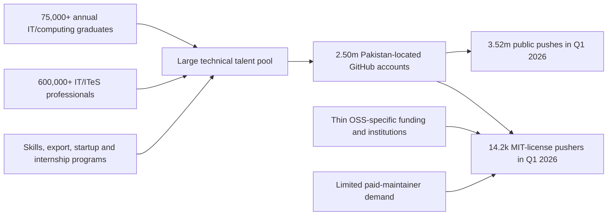
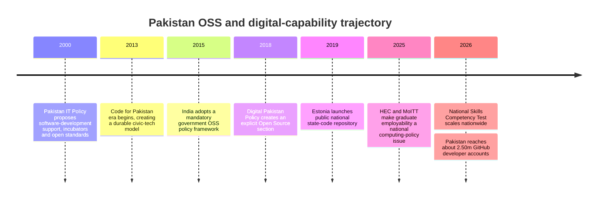
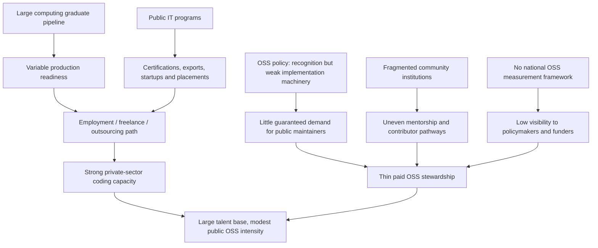

# Pakistan’s Open-Source Community: Large Talent Supply, Fast Growth, but Weak Conversion into Open-Source Capacity

## Executive summary

**Verdict: Pakistan’s open-source ecosystem is substantially stronger than it was five or six years ago, but it is not yet as strong as Pakistan’s supply of computing talent, population, or ambitions in the global digital economy would lead one to expect.** The weakness is not primarily a shortage of programmers. It is a conversion problem: Pakistan is producing a large pool of computing graduates and has accumulated millions of GitHub accounts, yet a comparatively small share of that capacity appears as sustained public, licensed software contribution, mature maintainer institutions, government-sponsored open-source infrastructure, or paid open-source stewardship. citeturn21search0turn22search0turn24search5

The supply side is already large. HEC said in September 2025 that Pakistan has **more than 75,000 IT graduates per year**; that figure covers computing/IT broadly rather than Computer Science alone, and I found no equally current official HEC publication isolating a CS-only annual graduate count. PSEB reports a workforce of **more than 600,000 IT and IT-enabled-services professionals**. For perspective, the 2018 Digital Pakistan Policy described an ecosystem of more than 20,000 IT graduates annually and more than 300,000 IT professionals, although definitions and reporting methodologies may not be identical across those dates. On the official figures, the graduate flow has therefore increased by at least roughly 3.75 times and the professional pool by roughly two times since the statistics used in that policy. citeturn21search0turn22search0turn22search2

GitHub data tell a similarly positive story about scale. In **Q1 2026**, GitHub’s Innovation Graph located **2,497,496 developer accounts** in Pakistan, associated Pakistan with **3,523,185 public git pushes**, **5,148,998 repositories**, and **74,034 GitHub organizations**. These figures are not synonymous with active OSS developers or OSS organizations: GitHub explicitly says its developer and organization counts can include inactive accounts/groups, its organization category includes companies, academic groups, nonprofits and informal collectives, and the Innovation Graph covers only public GitHub activity. fileciteturn7file1L19-L19 fileciteturn7file0L8-L8 fileciteturn7file2L30-L30 fileciteturn7file3L41-L41 citeturn24search5

The more revealing evidence is **contribution intensity rather than raw account count**. In Q1 2026, GitHub counted **14,211 Pakistan-located developers making at least one push to an MIT-licensed repository**, 3,056 to Apache-2.0 repositories, and 1,593 to GPL-3.0 repositories. The categories overlap, so they cannot be added to obtain a unique national OSS-contributor total. The MIT figure alone is nevertheless a reproducible lower-bound proxy for activity in clearly open-licensed public software. Pakistan generated about **5.57 MIT-repository pushers per 100,000 residents**, compared with **13.33 in India, 18.43 in Vietnam, and roughly 140.65 in Estonia**; Bangladesh, at 5.74, was close to Pakistan. citeturn16view0turn16view1turn16view2turn16view3turn16view4turn9search0turn9search1turn9search3

This does **not** mean Pakistan has a weak developer community. Pakistan's GitHub developer-account stock grew from about **317,000 in Q1 2020 to 2.50 million in Q1 2026**, nearly an eightfold increase. Public git pushes rose from about **236,000 to 3.52 million per quarter**, close to a fifteenfold increase. The trajectory is excellent. The problem is that the ecosystem is still thin relative to the country's scale and relative to competitors: Pakistan has about **979 GitHub developer accounts per 100,000 people**, versus about 1,826 in India and 2,926 in Vietnam, while public pushes per located GitHub account are about 1.41 in Pakistan, 1.67 in India, 1.61 in Bangladesh, 1.73 in Vietnam and 2.49 in Estonia. citeturn23search1turn24search7 fileciteturn0file0L2-L2 fileciteturn2file0L2-L2

The institutional contrast is at least as important. Pakistan's **Digital Pakistan Policy explicitly has an “Open Source” section**, but it consists of three general directives: build government capacity to evaluate OSS, give open and proprietary software fair consideration in procurement, and encourage open-source R&D. The current MoITT policy catalogue does not show a separate national OSS implementation policy, and in the current HEC, PSEB, MoITT and Ignite programs reviewed for this report I did not identify a named national **open-source maintenance fund, federal Open Source Program Office, public-sector source-code repository, or measured upstream-contribution program**. This is an evidence-of-documents-reviewed conclusion, not proof that no public rupee anywhere is spent on open source. citeturn27view0turn28view0turn26search4turn26search1turn26search2

That is notably different from several comparators. India's government adopted a mandatory OSS policy framework requiring government RFPs to consider OSS and requiring suppliers to justify excluding it; Estonia operates a national public source-code repository and now a function repository explicitly intended to foster reusable, community-driven public-sector development; and Bangladesh states that its National e-Service Bus is built using open-source tools and technologies. citeturn19view0turn20view0turn20view1turn18search3turn18search7turn18search1

The practical implication is therefore not “Pakistan needs many more CS graduates.” It needs to convert more of the graduates it already produces into **contributors, reviewers, maintainers, community leaders, public-code developers and internationally visible technical experts**. Under the scenario model in this report, Pakistan could plausibly reach roughly **4.4 million GitHub developer accounts and 27,500 quarterly MIT-license contributors by Q1 2030 without a major OSS policy change**. An aggressive but credible institutional program could instead produce roughly **5.5 million accounts and 47,000 MIT-license contributors**, while establishing several hundred paid maintainer roles and making open development a routine part of university and government software engineering. Those are modeled scenarios, not official forecasts.

## Evidence and measurement

There is no single authoritative statistic called “the size of Pakistan's open-source community.” Any serious assessment therefore has to separate **developer supply**, **public development activity**, **clearly open-licensed activity**, **community institutions**, and **state/industry support**. GitHub's Innovation Graph is unusually useful because it supplies reproducible country-level measurements from 2020 onward, but GitHub itself cautions that the dataset covers only public activity on GitHub and that locations are assigned from user activity rather than being a census of nationality. Developer-account counts can include accounts that are no longer active. citeturn23search4turn24search5

For this report, the closest primary-source metric for “open-source contribution” is GitHub's **license metric**: the number of unique developers in an economy who made at least one git push to a repository carrying a particular license during the quarter. A public MIT-licensed repository is clearly a stronger OSS signal than an undifferentiated public git push. But it still does not tell us whether the developer contributed to their own repository, an employer's repository, or an unrelated upstream project, and developers who push to multiple licenses appear in multiple license categories. GitHub's collaborator data would ideally supplement this, but the readily usable economy-level publication does not provide a simple nationality-by-third-party-accepted-PR series that can substitute for an OSS census. citeturn24search5turn14search0turn14search2

The denominator calculations below use the World Bank's latest 2025 population figures available for the comparison: approximately **255.2 million for Pakistan, 1.464 billion for India, 175.7 million for Bangladesh, 101.6 million for Vietnam and 1.366 million for Estonia**. Estonia is used as the high-performing benchmark because it combines unusually high per-capita GitHub activity with an explicit government practice of publishing reusable state source code; it is not presented as an economy structurally comparable to Pakistan. citeturn9search0turn9search1turn9search3turn18search3

The education statistics require equal caution. HEC's current public statement is **“over 75,000 annual IT graduates,”** not 75,000 BS Computer Science graduates. The category encompasses CS, IT and adjacent computing programs. The 2026 National Skill Competency Test explicitly covers students from Computer Science, IT, Software Engineering, AI, Data Science and related computing programs. I therefore use **75,000+ computing/IT graduates** as the official pipeline figure and do not manufacture a CS-only estimate. citeturn21search0turn21search2turn21search5

The following is the source hierarchy used for the principal variables.

| Data point | Highest-priority primary source used | Important limitation |
|---|---|---|
| Pakistan annual computing graduate supply | HEC, September 2025 industry/HEC consultation | Reports **75,000+ IT graduates**, not CS-only |
| Graduate competency | HEC National Skill Competency Test 2026 | Participants are advanced computing students; results are not a direct employment rate |
| ICT/ITeS workforce | PSEB annual reporting | Sector estimate, not a PBS occupation census |
| GitHub developer accounts, pushes, repositories, organizations | GitHub Innovation Graph raw CSVs | Public GitHub only; accounts/orgs may be inactive |
| Open-licensed activity | GitHub Innovation Graph license dataset | License categories overlap; does not isolate third-party upstream PRs |
| Population normalization | World Bank population database | Population denominator, not working-age developer population |
| Pakistan OSS policy | MoITT Digital Pakistan Policy and current policy catalogue | Policy intent does not demonstrate implementation |
| OSS/community institutions | OSFP official GitHub, POSF official site, Code for Pakistan official reports/GitHub | No national legal-registry classification for “OSS organization” |
| Public support/funding | MoITT, PSEB, HEC and Ignite official program/report pages | Most funding is technology-, skills-, startup- or export-oriented rather than OSS-specific |

HEC itself has had timeliness issues in higher-education statistical collection: its official data-collection notices show continuing acquisition and validation work for 2023–24 and 2024–25. That reinforces the reason for reporting the 75,000+ figure as an official order-of-magnitude statistic rather than pretending to possess a precisely harmonized 2026 CS-graduation census. citeturn6search6turn6search9

## Current state

Pakistan today has a **large computing pipeline, a rapidly expanding developer population and a real but institutionally fragmented open-source community**.

| Pakistan metric | Latest usable official/primary figure | What it actually measures |
|---|---:|---|
| Annual IT/computing graduates | **75,000+** | HEC's broad IT/computing graduate pipeline citeturn21search0 |
| IT/ITeS professionals | **600,000+** | PSEB industry workforce estimate citeturn22search0 |
| GitHub developer accounts, Q1 2026 | **2,497,496** | Located GitHub accounts, including potentially inactive accounts fileciteturn7file1L19-L19 |
| Public git pushes, Q1 2026 | **3,523,185** | Public GitHub push events, not OSS-only fileciteturn7file0L8-L8 |
| Repositories attributed to Pakistan, Q1 2026 | **5,148,998** | Repositories located by maintainers; may include inactive repositories fileciteturn7file2L30-L30 |
| GitHub organizations, Q1 2026 | **74,034** | Companies, academic groups, nonprofits and informal groups—not “74,034 OSS organizations” fileciteturn7file3L41-L41 |
| Developers pushing to MIT-licensed repos, Q1 2026 | **14,211** | Distinct Pakistan-located developers for this license |
| Apache-2.0 pushers, Q1 2026 | **3,056** | Distinct developers for this license |
| GPL-3.0 pushers, Q1 2026 | **1,593** | Distinct developers for this license |
| Dedicated OSS-community bodies identifiable from official presences | **At least two self-described foundations, plus informal groups** | Lower bound, not an authoritative national census |
| Dedicated national OSS maintenance budget found | **None identifiable in reviewed current programs** | Does not prove that individual programs never fund OSS |

The license figures come directly from GitHub's official Innovation Graph license release. They should **not be summed**, because a single developer can push to MIT, Apache and GPL repositories in the same quarter. The safe statement is that at least 14,211 distinct Pakistan-located developers performed a clearly open-licensed MIT push during Q1 2026, while the true number active across all open-source licenses is higher but cannot be deduplicated from the aggregate release. citeturn16view0turn24search5

The raw trajectory is impressive. Pakistan's GitHub developer-account base has increased by roughly **7.9 times since Q1 2020**, while public quarterly pushes increased by roughly **14.9 times**. This means the ecosystem is not stagnant: participation is growing considerably faster than the country's population. The issue is whether that growth is being transformed into globally important projects, repeat maintainers, recognized technical communities and institutional capability. citeturn23search1turn24search7 fileciteturn0file0L2-L2 fileciteturn2file0L2-L2

There is also evidence of a **quality/conversion constraint inside the education pipeline**. HEC's 2026 National Skill Competency Test processed 57,241 candidate records and recorded 33,038 completed assessments. The official report gives a national average of **46.28/100**, with 61.4% falling in the HEC “F” band and only 13.6% exceeding the 60-point threshold. This test should not be interpreted as proving that 61.4% of computing graduates are unemployable; it is one standardized assessment. But it strongly supports HEC and MoITT's own diagnosis that graduate volume and immediately usable technical competence are not the same thing. citeturn21search1turn21search3

HEC's response is substantial: Computing Curriculum 2025, a reported **80% hands-on orientation**, industry-linked final-year-project proposals, a centralized competency test, internships and professional certification pathways. The NSCT was conducted across 165 centers in 112 cities in April 2026, demonstrating that Pakistan now has infrastructure to implement national computing-skills interventions at meaningful scale. citeturn21search3turn21search4turn21search6

Yet very little of this machinery is explicitly designed around **open-source production**. HEC's Digital Learning and Skills Enrichment Initiative does expose students to Linux Foundation material on open-source development, Linux and Git, but open-source contribution is not yet a nationally reported graduation outcome or accreditation metric. citeturn26search7turn26search3

Government support for technology more broadly is not small. MoITT's published program included a roughly **PKR 1 billion IT skills project**, an industry-placement concept for 20,000 final-semester ICT students, and certifications for thousands of participants. PSEB's current ecosystem programs target thousands of apprenticeships, bootcamp seats, industry-academia trainings and internationally recognized certifications. Ignite reports more than **5.48 million cumulative DigiSkills trainings** and operates technology grants and a national incubation network. PSEB also explicitly lists “open source technologies” among specialized fields it seeks to develop. citeturn7view3turn8view0turn22search6turn26search2turn26search9

The mismatch is therefore striking: **Pakistan already spends public money on the ingredients of an open-source ecosystem—students, R&D, skills, startups, incubators and digital government—but its public programs rarely purchase the final public good of maintained open-source code.** HEC's research-and-innovation machinery has funded thousands of projects across disciplines, while PSEB and Ignite operate substantial capacity programs; nevertheless, the official current programs reviewed do not expose an OSS-specific maintenance budget or national maintainer fellowship. citeturn21search9turn26search11turn26search1turn26search2

The community-institution picture is similarly mixed. **Open Source Foundation Pakistan (OSFP)** has an official GitHub organization with 206 repositories, although many visible repositories are forks and the prominently displayed update history is concentrated around 2019–20. **Pakhtunkhwa Open Source Foundation (POSF)** maintains an official site, leadership structure, membership process, Executive Council/General Body mechanism and an educational LMS. **Code for Pakistan** is much more visibly active at national civic-technology scale: its official site identifies the underlying Foundation for Civic Tech as a Section 42 nonprofit, its 2024 report records a community of 34,000+, 400+ volunteers and 7,000+ event attendees, its 2025 report says it engaged more than 15 government departments and trained 400+ public servants, and its official GitHub organization exposes 259 repositories. citeturn17search2turn17search0turn17search3turn17search6turn17search4turn17search7turn17search10

There is also an **OSSpk** GitHub organization that explicitly describes itself as a movement encouraging Pakistani developers and students to embrace open source, but it is better understood as a community initiative than a verified legal representative entity. From primary sources alone, a defensible conclusion is therefore: Pakistan has **at least two dedicated self-described open-source foundations, one substantial registered civic-tech nonprofit with major open-development activity, and additional informal communities**, but there is no primary-source basis for claiming a complete national count or a single body mandated to represent the whole OSS community. citeturn17search5turn17search0turn17search2turn17search4

The left side of this flow is well evidenced by HEC and PSEB; the weakness is the institutional bridge on the right. The diagram represents an analytical relationship rather than a claim that each annual graduate directly becomes a GitHub account. citeturn21search0turn22search0turn26search1turn24search5

## Comparative position and historical parallels

The cross-country picture makes Pakistan's under-conversion visible. The table uses Q1 2026 standard Innovation Graph data and 2025 World Bank populations. “MIT pushers” are unique developers who pushed to at least one MIT-licensed repository during that quarter. “Pushes/account” is an ecosystem-intensity ratio, **not a measure of individual developer productivity**, because the account denominator includes inactive accounts. citeturn24search5turn9search0turn9search1turn9search3

| Economy | Population, 2025 | GitHub developer accounts | Developers per 100k | Public pushes, Q1 2026 | Pushes per account | MIT-license pushers | MIT pushers per 100k | GitHub orgs per 100k |
|---|---:|---:|---:|---:|---:|---:|---:|---:|
| **Pakistan** | 255.2m | 2,497,496 | **979** | 3,523,185 | **1.41** | 14,211 | **5.57** | **29.0** |
| **India** | 1,463.9m | 26,727,004 | **1,826** | 44,658,960 | **1.67** | 195,150 | **13.33** | **52.2** |
| **Bangladesh** | 175.7m | 1,882,249 | **1,071** | 3,026,760 | **1.61** | 10,081 | **5.74** | **33.1** |
| **Vietnam** | 101.6m | 2,972,715 | **2,926** | 5,146,573 | **1.73** | 18,721 | **18.43** | **155.6** |
| **Estonia** | 1.37m | 149,001 | **10,904** | 371,519 | **2.49** | 1,922 | **140.65** | **696.3** |

The underlying GitHub account, push, repository and organization values come from GitHub's official Innovation Graph CSVs; the license observations come from its license dataset. Population-normalized values above are calculations from those official GitHub values and World Bank population figures. fileciteturn0file0L2-L2 fileciteturn2file0L2-L2 fileciteturn3file0L2-L2 citeturn16view0turn16view1turn16view2turn16view3turn16view4turn9search0turn9search1turn9search3

Several conclusions follow.

Pakistan is **not dramatically behind Bangladesh** on per-capita developer or licensed-contribution measures. Its developer density is roughly 91% of Bangladesh's and its MIT-pusher density about 97%; its public push/account ratio is lower. In other words, among the two South Asian lower-middle-income peers, Pakistan is broadly in the same band. The concern is that **being roughly level with Bangladesh is a modest outcome for a country with Pakistan's stated IT-export ambitions and substantially larger computing pipeline**. citeturn21search0turn22search4

Against India, Pakistan has about **54% of the GitHub-developer density and 42% of the MIT-pusher density**. If Pakistan merely matched India's current MIT-pusher rate per capita, its Q1 2026-equivalent count would be about **34,000 rather than 14,211**—roughly 20,000 additional MIT-license contributors at Pakistan's current population. Matching India's GitHub-account density would imply roughly **4.66 million accounts instead of 2.50 million**. These are counterfactual calculations, not forecasts. citeturn16view0turn16view1turn9search0turn9search1

Vietnam presents the more challenging competitive comparison. Despite having less than half Pakistan's population, Vietnam has **more GitHub developer accounts, substantially more organizations per capita, more quarterly public pushes, and over three times Pakistan's MIT-pusher density**. At Vietnam's present MIT-pusher rate, Pakistan's population would correspond to approximately **47,000 quarterly MIT-license pushers**, more than three times Pakistan's observed 14,211. fileciteturn0file0L2-L2 fileciteturn2file0L2-L2 fileciteturn3file0L2-L2 citeturn16view0turn16view3turn9search0turn9search3

Estonia is deliberately an aspirational rather than socioeconomic comparator. Its per-capita GitHub densities are an order of magnitude beyond Pakistan's, but the institutional lesson is more important than the numerical gap: Estonia's Information System Authority operates a **National Code Repository** in which government source code is public and reusable, and its newer National Function Repository is explicitly intended to promote a community-driven open-development model and reduce duplicated public-sector software work. citeturn18search3turn18search7turn18search11

Historical policy choices help explain these differences. Pakistan's **IT Policy and Action Plan 2000** already recognized open Internet standards, called for a Software Development Fund and proposed incubation infrastructure. Eighteen years later, the Digital Pakistan Policy explicitly added an Open Source section. The policy therefore cannot be described as hostile to open source; the recurring problem has been translating broad encouragement into durable institutions, budgets, procurement rules and maintainer careers. citeturn26search8turn27view0

India offers the clearest regional contrast. Its government OSS policy states that government organizations should prefer OSS in e-government systems; its **nature of compliance is mandatory**; future RFPs must include OSS consideration, suppliers must justify OSS exclusion, and the implementation section calls for institutional support and active collaboration with OSS communities. Pakistan's corresponding policy asks procurement to give open and proprietary software **fair consideration**, which is much weaker as a demand signal. citeturn19view0turn20view0turn20view1turn28view0

Bangladesh provides a different model: its National Digital Architecture emphasizes common standards, interoperability and component reuse, and the Bangladesh Computer Council states that the national e-Service Bus is built using open-source tools and technologies including the WSO2 stack. This is significant because it makes open technology part of shared government infrastructure rather than solely a volunteer-community concern. citeturn18search1turn18search5

Vietnam's current National Digital Architecture similarly emphasizes shared platforms, data connectivity, reuse and avoiding duplicated investment. The primary source reviewed here does **not** establish an India-style OSS-first rule, so it would be wrong to claim one; the relevant lesson is the systematic treatment of reusable digital infrastructure as a national capability. citeturn18search6turn18search10

Pakistan itself already has a successful local parallel in **civic technology**. Code for Pakistan has operated since the early 2010s, works directly with government, maintains hundreds of public repositories and has built fellowships, internships, university labs and volunteer communities around public problems. Its 2025 reporting shows engagement with more than 15 government departments and over 400 public servants, while its GitHub organization contains active government-service and civic projects. That is evidence that the Pakistan context can support mission-driven public technology when community, government and structured programs are connected. citeturn17search7turn17search10

The timeline illustrates a key historical divergence: Pakistan recognized the issue early, but India and Estonia subsequently attached stronger implementation mechanisms to public software, while Pakistan's most energetic recent interventions have concentrated on employability, exports, freelancing, AI and certifications. citeturn26search8turn28view0turn20view1turn18search7turn21search3turn21search4

## Why the ecosystem underperforms

**The first root cause is misaligned incentives rather than insufficient talent.** Pakistan's government technology apparatus rationally focuses on employment, exports and foreign exchange: PSEB's mission is to expand IT industry capability and exports, current programs emphasize apprenticeships, professional certifications, BPO, bootcamps, marketing and international market access, and MoITT's historical targets have explicitly linked large additions of skilled professionals to export growth. These programs may use open source extensively, but they reward a graduate for becoming billable to a client more directly than for spending hundreds of hours maintaining a dependency used by thousands of firms. citeturn26search1turn22search6turn7view3

That distinction matters. A country can have a booming outsourcing and freelancing sector while remaining a relatively small producer of globally governed open infrastructure. Client work is often private; GitHub's Innovation Graph does not see private repositories at all. Consequently, part of Pakistan's apparent open-source gap certainly reflects activity hidden in proprietary/client systems. But that caveat does not eliminate the gap in **public goods, reputation and maintainer institutions**—the very outputs that open source is meant to expose. citeturn23search4turn24search5

**The second cause is a graduate-readiness problem.** HEC and MoITT themselves describe an industry–academia gap, have redesigned the computing curriculum around hands-on work, and created a national competency test precisely because degree completion does not reliably mean zero-day productive capability. Open-source contribution is particularly demanding: a new contributor must read an unfamiliar codebase, use Git fluently, understand tests and continuous integration, communicate asynchronously, receive review and revise code to somebody else's standards. Traditional classroom programming assignments do not automatically generate these skills. citeturn21search2turn21search3turn21search6

**The third cause is a policy-to-implementation gap.** Pakistan's 2018 policy explicitly recognized open source, so lack of awareness is not the problem. But its three clauses do not set an adoption target, identify a responsible OSPO, require publication of publicly funded custom software, define approved licenses, establish a source-code repository, create maintainer grants, or require vendors to justify withholding reusable code. India's policy contains much more concrete procurement machinery; Estonia built the repository itself. citeturn28view0turn20view1turn18search3

**The fourth cause is institutional fragmentation.** OSFP, POSF, OSSpk and Code for Pakistan provide pieces of an ecosystem, but primary sources do not reveal a current nationwide federation with a transparently measured membership of maintainers, university chapters, companies and user groups, a recurring national conference, a public national project census and a formal consultation role on government OSS policy. POSF has a membership/governance design and Code for Pakistan has institutional scale, but neither constitutes evidence of a single national representative body for all Pakistani open-source contributors. citeturn17search0turn17search3turn17search5turn17search7

**The fifth cause is weak funding for maintenance as a category of work.** Pakistan demonstrably knows how to fund targeted technical capacity: MoITT has operated billion-rupee-scale skills programs, HEC runs multibillion-rupee research portfolios, PSEB has large national workforce programs, and a PSEB publication describes a **PKR 4.8 billion semiconductor HR initiative** training thousands of engineers. In the primary sources reviewed, there is no comparable named program whose product is the security, maintenance and upstream development of open digital infrastructure. citeturn7view3turn21search9turn22search5turn26search2

**The sixth cause is measurement failure.** Pakistan measures IT exports, registered companies, trainings, certifications, internship placements and increasingly student competency. It does not yet publish a corresponding national metric for accepted open-source pull requests, repeat contributors, maintainers, dependencies maintained by Pakistan-based teams, public-sector code released, vulnerability fixes delivered upstream, or women and regional participation in OSS. Without these measurements, open-source production is nearly invisible to policymakers even when it creates international reputation and reusable economic infrastructure. citeturn22search1turn22search6turn21search1turn26search4

This synthesis explains why Pakistan can simultaneously possess a large and fast-growing software workforce **and** underperform on visible OSS intensity. The two observations are not contradictory. citeturn22search0turn24search5turn28view0

## Scenarios to 2030

A useful forecast should not extrapolate Pakistan's extraordinary 2020–26 GitHub growth indefinitely. Developer accounts grew at roughly **41% compound annualized** over that period and public pushes even faster; as the base becomes larger, those rates should naturally decelerate. The scenarios below therefore deliberately assume much slower future account growth. Baselines are Q1 2026 GitHub data and a conservative 600,000-person floor for the IT/ITeS workforce. citeturn22search0 fileciteturn0file0L2-L2 fileciteturn2file0L2-L2

The model is **not an official forecast**. “MIT contributors” means developers pushing to MIT-licensed repositories in a quarter and remains a proxy rather than a complete count of OSS contributors.

| Q1 2030 scenario | Main assumptions, 2026–30 | GitHub developer accounts | Public pushes / quarter | MIT-license pushers / quarter | MIT pushers as % of developer-account stock | IT/ITeS workforce floor | Annual IT graduates by 2030 |
|---|---|---:|---:|---:|---:|---:|---:|
| **Worst case** | Developer accounts +8%/yr; pushes +5%; MIT contributors +5%; workforce +3%; no new OSS institutions | **3.40m** | **4.28m** | **17.3k** | **0.51%** | **675k** | **~75k** |
| **Likely / continuity** | Accounts +15%; pushes +15%; MIT contributors +18%; workforce +7%; current skills reforms continue but OSS stays secondary | **4.37m** | **6.16m** | **27.6k** | **0.63%** | **786k** | **~90k** |
| **Best plausible** | Accounts +22%; pushes +25%; MIT contributors +35%; workforce +10%; coordinated university, procurement, OSPO and maintenance-fund reforms | **5.53m** | **8.60m** | **47.2k** | **0.85%** | **878k** | **~110k** |

The graduate figures assume approximately zero, 4.7% and 10% annual growth respectively from the official 75,000 baseline. The workforce calculations use exactly 600,000 as a conservative starting point even though PSEB says “over” 600,000, so those modeled workforce outcomes should be read as approximate floors rather than precise forecasts. citeturn21search0turn22search0

**The worst case is not collapse.** Pakistan's enormous demographic and educational base makes continued numerical growth likely even without OSS reform. The failure mode is instead that the country acquires millions more GitHub accounts but remains predominantly a consumer of global open source and a provider of private client development, with relatively few internationally consequential maintainer teams. In this case the OSS-contribution proxy grows more slowly than the developer population, and the conversion ratio falls from roughly 0.57% today to about 0.51%.

**The continuity case is respectable but insufficient for leadership.** Existing HEC, PSEB and MoITT programs should improve practical skills, increase the software workforce and naturally create more public projects. About 27,500 quarterly MIT-license contributors would be almost twice today's figure. Yet the modeled conversion rate reaches only 0.63%, around Vietnam's current ratio of MIT-license pushers to total GitHub-account stock and still below India's current roughly 0.73%. Since India and Vietnam will not stand still, merely reaching their **2026** intensity by **2030** would not close the competitive frontier. citeturn16view1turn16view3

**The best plausible case requires institutional change rather than just more degrees.** Roughly 47,000 quarterly MIT-license pushers would put Pakistan close to the number implied today by applying Vietnam's current per-capita MIT-pusher density to Pakistan's population. A 0.85% MIT-pusher/account ratio would also exceed India's present ratio, though not Estonia's. The main assumption is that open-source contribution becomes a funded professional activity and a university/government engineering pathway rather than an extracurricular hobby. citeturn16view0turn16view1turn16view3turn16view4

The most important observation from the scenarios is that **Pakistan does not need another order-of-magnitude expansion in graduate production to obtain an order-of-magnitude improvement in strategic OSS capacity**. Moving even a few percent of the existing 75,000+ annual computing graduate stream through structured open-source apprenticeships would create thousands of new contributors every year. The binding constraints are mentorship, paid time, project selection, code-review capacity and sustained institutional demand. citeturn21search0turn21search3

## Priority interventions and source map

The highest-return strategy is to treat open source as **national digital infrastructure and human-capital formation simultaneously**, rather than as a software-licensing preference. Pakistan already possesses most of the machinery required—HEC, PSEB, Ignite, universities, public-sector digital programs and functioning civic-tech organizations. The challenge is to redirect a small fraction of that machinery toward public, reusable software. citeturn26search11turn26search1turn26search2turn17search7

| Priority | Intervention | Proposed timing | Illustrative scale and cost | Modeled impact by 2030 |
|---|---|---|---|---|
| **Highest** | **Federal Open Source Program Office and “public code by default” procurement rule** | Policy in 6–12 months; first agencies within 18 months | PKR 300–600m setup, then roughly PKR 200–400m/yr; pilot 10 agencies, expand toward 25 | 300–500 paid public-code/maintainer roles; 500+ reusable public repositories; major increase in government–community contribution |
| **Highest** | **HEC Open Source Practicum / Fellowship** embedded in CS, SE, IT, AI and DS programs | Design in 2026–27; national rollout by 2028 | 50 universities initially; ~10,000 students exposed each year; PKR 600m–1bn/yr including mentors/fellows | ~2,000–4,000 repeat contributors by 2030; contribution becomes a portfolio/employability signal |
| **Highest** | **Pakistan Open Digital Infrastructure Maintenance Fund** | Establish within 12–18 months | PKR 1–2bn/yr; competitive grants to 100–200 locally relevant/upstream projects | 500–1,000 paid maintainer-equivalent positions and perhaps 3,000–6,000 repeat contributors around funded projects |
| **High** | **National OSS federation and mentor network**, built from existing communities rather than replacing them | 6–12 months | PKR 100–250m/yr; chapters in major university/technology centers | 1,000–2,000 additional repeat contributors; national conference, project census and representative policy voice |
| **High** | **PSEB industry incentive for verified upstream contributions** | 12–24 months | Add upstream-contribution targets to grants, export-readiness and internship programs; matched private funding | 200+ companies in initial program; 2,000–5,000 engineers receiving paid upstream time by 2030 |
| **Foundational** | **National OSS measurement dashboard** | First release within 6 months | Small data/program team; GitHub plus voluntary GitLab/project reporting | Annual measurement of contributors, maintainers, projects, government releases, regional/gender participation and security work |

These costs and impacts are **analytical estimates, not existing government commitments or vendor quotations**. An overall national envelope of approximately **PKR 2–4 billion per year** would be a reasonable order of magnitude for the combined fellowship, maintenance and institutional package. That scale is deliberately benchmarked against programs Pakistan already undertakes: roughly PKR 1 billion for a major IT-skills intervention, multibillion-rupee HEC research portfolios, and a reported PKR 4.8 billion semiconductor human-capital initiative. The proposal is therefore not predicated on an unprecedented type of public investment; it changes what technical output some existing-scale investment purchases. citeturn7view3turn21search9turn22search5

The **procurement reform is the most structurally important intervention**. Pakistan should move from the Digital Pakistan Policy's neutral “fair consideration” language toward an India-style requirement that every new custom government software procurement explicitly evaluate reuse and open-source release, with written justification when reusable source code cannot be published for security, privacy, licensing or strategic reasons. For custom software funded by the public, contracts should assign the government sufficient intellectual-property rights to publish reusable components, require standard dependency inventories and security practices, and budget for maintenance after initial delivery. India's mandatory RFP mechanism and Estonia's public code repository demonstrate two workable pieces of this model. citeturn28view0turn20view0turn20view1turn18search3

The purpose would **not** be to prohibit proprietary software. Pakistan's own policy is correct that security, capability and lifetime cost matter. The reform should distinguish commodity proprietary products from **custom taxpayer-funded software**, where vendor lock-in and repeated reinvention are especially avoidable. India's policy itself permits justified exceptions, demonstrating that an OSS preference need not become ideological absolutism. citeturn19view0

The **university intervention should focus on real upstream work rather than student GitHub activity for its own sake**. A qualifying practicum should require work against an existing project with an issue tracker, review process, tests and an identifiable external or institutional maintainer. Accepted documentation, localization, test coverage, security fixes and design work should count alongside code. HEC already has the national coordination infrastructure, competency testing, revised computing curriculum and industry-placement agenda needed to administer such a program. citeturn21search2turn21search4turn21search6

A realistic model would expose roughly **10,000 students per year**—only around 13% of the current 75,000+ annual IT-graduate flow—to a structured OSS practicum. If one-quarter completed a meaningful accepted contribution and roughly one-third of those became repeat contributors, the program would create on the order of **750 sustained contributors per cohort**, before accounting for spillovers into classmates, startups and employers. Over several cohorts, 2,000–4,000 durable additional contributors by 2030 is therefore a plausible program target rather than an extraordinary assumption. The percentages are modeling assumptions, while the 75,000+ pipeline is HEC's official figure. citeturn21search0

The **maintenance fund** addresses a different problem: Pakistan needs not only novices but people who remain maintainers after becoming skilled enough to command commercial salaries. Grants should therefore pay for boring but economically important work—dependency upgrades, release engineering, security response, documentation, accessibility, localization, testing, package maintenance and upstream fixes—not just new apps. Projects could qualify either because they originate in Pakistan or because they are internationally important dependencies heavily used by Pakistani government, universities or industry. This would allow Pakistan to gain global credibility by becoming a steward of international infrastructure, rather than limiting “Pakistani OSS” to software invented locally.

A **community federation** should likewise federate rather than nationalize the ecosystem. OSFP, POSF, Code for Pakistan, OSSpk, university groups, independent maintainers and industry engineering teams could retain their identities while participating in a transparent Pakistan Open Source Council or equivalent. Membership rules, annual elections, published finances, project working groups and an annual maintainer census would make it possible for government and industry to consult an identifiable community without pretending that one existing organization already speaks for everyone. The need for such a federation follows from the fragmented primary-source landscape documented above. citeturn17search0turn17search2turn17search3turn17search5turn17search7

Finally, **measurement should begin before the larger programs are fully funded**. The dashboard should report at least quarterly or annually: public GitHub/GitLab contributors, first-time and repeat contributors, maintainers, open-license activity, accepted external pull requests where projects can supply them, public-sector repositories, released government components, known dependencies receiving Pakistani maintenance funding, university participants, security fixes, and geographic and gender participation. GitHub's own Innovation Graph already establishes a reproducible national baseline; Pakistan would be adding the institutional and project-level information that the global dataset cannot provide. citeturn23search4turn24search5

**The prioritized official-source map for continued measurement is therefore:**

| Metric to track | First-choice official/primary source | Second-choice cross-check |
|---|---|---|
| Annual CS/computing graduates | **HEC Higher Education Statistics / HEC computing releases** citeturn21search0turn21search9 | NCEAC/NSCT administrative data citeturn21search2turn21search4 |
| Graduate skills/readiness | **HEC NSCT** citeturn21search1 | HEC/PSEB industry–academia program results citeturn21search3turn22search6 |
| ICT workforce | **PSEB industry census/annual report** citeturn22search0turn22search1 | PBS Labour Force Survey when occupation-level ICT tables permit a comparable count citeturn0search1 |
| Public development activity | **GitHub Innovation Graph raw data** citeturn23search4turn24search5 | Future Pakistan community census |
| Clearly licensed OSS activity | **GitHub Innovation Graph licenses** citeturn16view0 | Project-maintainer reports / GitLab data |
| Government OSS adoption | **MoITT procurement and policy reporting** citeturn26search4turn28view0 | Federal/provincial source-code registry, once created |
| Public technology funding | **MoITT/PSEB/HEC/Ignite annual reports and PSDP/project reporting** citeturn21search9turn22search1turn26search2 | Audited program-level financial statements |
| Community institutions | **Registered entities' filings plus their official governance records** | OSFP/POSF/Code for Pakistan/other official organization pages citeturn17search0turn17search2turn17search7 |
| International benchmark | **GitHub + World Bank**, with national digital-government sources | India MeitY, Bangladesh BCC, Estonia RIA, Vietnam ministry sources citeturn20view1turn18search1turn18search3turn18search6 |

The biggest unresolved data gaps are therefore explicit rather than hidden: **there is no verified current CS-only graduation figure in the primary sources reviewed; no clean PBS-based current ICT-workforce number comparable to PSEB's industry estimate; no deduplicated national total of OSS contributors across licenses and platforms; no official registry category that yields a count of Pakistani OSS organizations; and no transparent national accounting line for OSS-specific public spending.** GitHub also omits private development and non-GitHub platforms, so Pakistan's overall software-engineering capacity is certainly larger than the public metrics show. citeturn21search0turn22search0turn23search4turn24search5

Those gaps do not change the central finding. **Pakistan has already solved much of the difficult supply problem: it has tens of thousands of new computing graduates every year, more than half a million IT professionals, millions of developer accounts, rapidly rising public coding activity, government technology institutions and examples of successful civic-technology organization. What it has not yet built at comparable scale is the institutional machinery that turns those assets into maintained global open-source infrastructure.** The difference between Pakistan's likely and best 2030 outcomes is therefore less about producing more programmers than about whether universities, government and industry begin treating open-source contribution and maintenance as real work worth teaching, procuring, measuring and paying for. citeturn21search0turn22search0turn17search7turn28view0